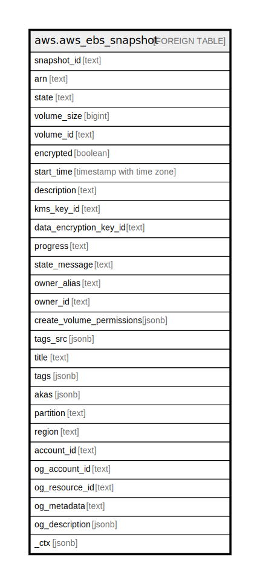

# aws.aws_ebs_snapshot

## Description

AWS EBS Snapshot

## Columns

| Name | Type | Default | Nullable | Children | Parents | Comment |
| ---- | ---- | ------- | -------- | -------- | ------- | ------- |
| snapshot_id | text |  | true |  |  | The ID of the snapshot. Each snapshot receives a unique identifier when it is created. |
| arn | text |  | true |  |  | The Amazon Resource Name (ARN) specifying the snapshot. |
| state | text |  | true |  |  | The snapshot state. |
| volume_size | bigint |  | true |  |  | The size of the volume, in GiB. |
| volume_id | text |  | true |  |  | The ID of the volume that was used to create the snapshot. Snapshots created by the CopySnapshot action have an arbitrary volume ID that should not be used for any purpose. |
| encrypted | boolean |  | true |  |  | Indicates whether the snapshot is encrypted. |
| start_time | timestamp with time zone |  | true |  |  | The time stamp when the snapshot was initiated. |
| description | text |  | true |  |  | The description for the snapshot. |
| kms_key_id | text |  | true |  |  | The Amazon Resource Name (ARN) of the AWS Key Management Service (AWS KMS) customer master key (CMK) that was used to protect the volume encryption key for the parent volume. |
| data_encryption_key_id | text |  | true |  |  | The data encryption key identifier for the snapshot. This value is a unique identifier that corresponds to the data encryption key that was used to encrypt the original volume or snapshot copy. Because data encryption keys are inherited by volumes created from snapshots, and vice versa, if snapshots share the same data encryption key identifier, then they belong to the same volume/snapshot lineage. |
| progress | text |  | true |  |  | The progress of the snapshot, as a percentage. |
| state_message | text |  | true |  |  | Encrypted Amazon EBS snapshots are copied asynchronously. If a snapshot copy operation fails this field displays error state details to help you diagnose why the error occurred. |
| owner_alias | text |  | true |  |  | The AWS owner alias, from an Amazon-maintained list (amazon). This is not the user-configured AWS account alias set using the IAM console. |
| owner_id | text |  | true |  |  | The AWS account ID of the EBS snapshot owner. |
| create_volume_permissions | jsonb |  | true |  |  | The users and groups that have the permissions for creating volumes from the snapshot. |
| tags_src | jsonb |  | true |  |  | A list of tags assigned to the snapshot. |
| title | text |  | true |  |  | Title of the resource. |
| tags | jsonb |  | true |  |  | A map of tags for the resource. |
| akas | jsonb |  | true |  |  | Array of globally unique identifier strings (also known as) for the resource. |
| partition | text |  | true |  |  | The AWS partition in which the resource is located (aws, aws-cn, or aws-us-gov). |
| region | text |  | true |  |  | The AWS Region in which the resource is located. |
| account_id | text |  | true |  |  | The AWS Account ID in which the resource is located. |
| og_account_id | text |  | true |  |  | The Platform Account ID in which the resource is located. |
| og_resource_id | text |  | true |  |  | The unique ID of the resource in opengovernance. |
| og_metadata | text |  | true |  |  | Platform Metadata of the AWS resource. |
| og_description | jsonb |  | true |  |  | The full model description of the resource |
| _ctx | jsonb |  | true |  |  | Steampipe context in JSON form, e.g. connection_name. |

## Relations

---

> Generated by [tbls](https://github.com/k1LoW/tbls)
