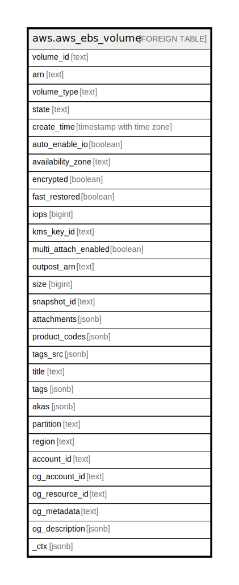

# aws.aws_ebs_volume

## Description

AWS EBS Volume

## Columns

| Name | Type | Default | Nullable | Children | Parents | Comment |
| ---- | ---- | ------- | -------- | -------- | ------- | ------- |
| volume_id | text |  | true |  |  | The ID of the volume. |
| arn | text |  | true |  |  | The Amazon Resource Name (ARN) specifying the volume. |
| volume_type | text |  | true |  |  | The volume type. This can be gp2 for General Purpose SSD, io1 or io2 for Provisioned IOPS SSD, st1 for Throughput Optimized HDD, sc1 for Cold HDD, or standard for Magnetic volumes. |
| state | text |  | true |  |  | The volume state. |
| create_time | timestamp with time zone |  | true |  |  | The time stamp when volume creation was initiated. |
| auto_enable_io | boolean |  | true |  |  | The state of autoEnableIO attribute. |
| availability_zone | text |  | true |  |  | The Availability Zone for the volume. |
| encrypted | boolean |  | true |  |  | Indicates whether the volume is encrypted. |
| fast_restored | boolean |  | true |  |  | Indicates whether the volume was created using fast snapshot restore. |
| iops | bigint |  | true |  |  | The number of I/O operations per second (IOPS) that the volume supports. |
| kms_key_id | text |  | true |  |  | The Amazon Resource Name (ARN) of the AWS Key Management Service (AWS KMS) customer master key (CMK) that was used to protect the volume encryption key for the volume. |
| multi_attach_enabled | boolean |  | true |  |  | Indicates whether Amazon EBS Multi-Attach is enabled. |
| outpost_arn | text |  | true |  |  | The Amazon Resource Name (ARN) of the Outpost. |
| size | bigint |  | true |  |  | The size of the volume, in GiBs. |
| snapshot_id | text |  | true |  |  | The snapshot from which the volume was created, if applicable. |
| attachments | jsonb |  | true |  |  | Information about the volume attachments. |
| product_codes | jsonb |  | true |  |  | A list of product codes. |
| tags_src | jsonb |  | true |  |  | A list of tags assigned to the volume. |
| title | text |  | true |  |  | Title of the resource. |
| tags | jsonb |  | true |  |  | A map of tags for the resource. |
| akas | jsonb |  | true |  |  | Array of globally unique identifier strings (also known as) for the resource. |
| partition | text |  | true |  |  | The AWS partition in which the resource is located (aws, aws-cn, or aws-us-gov). |
| region | text |  | true |  |  | The AWS Region in which the resource is located. |
| account_id | text |  | true |  |  | The AWS Account ID in which the resource is located. |
| og_account_id | text |  | true |  |  | The Platform Account ID in which the resource is located. |
| og_resource_id | text |  | true |  |  | The unique ID of the resource in opengovernance. |
| og_metadata | text |  | true |  |  | Platform Metadata of the AWS resource. |
| og_description | jsonb |  | true |  |  | The full model description of the resource |
| _ctx | jsonb |  | true |  |  | Steampipe context in JSON form, e.g. connection_name. |

## Relations

---

> Generated by [tbls](https://github.com/k1LoW/tbls)
