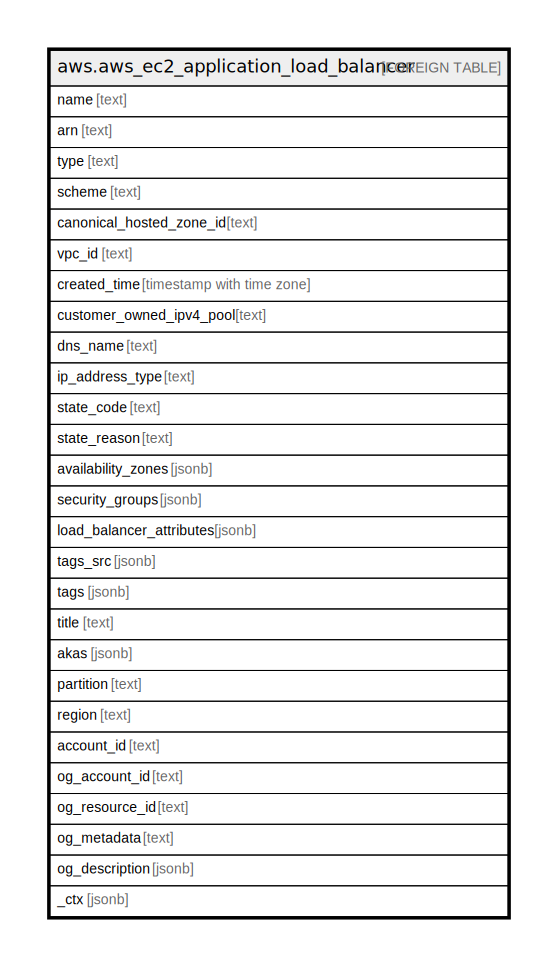

# aws.aws_ec2_application_load_balancer

## Description

AWS EC2 Application Load Balancer

## Columns

| Name | Type | Default | Nullable | Children | Parents | Comment |
| ---- | ---- | ------- | -------- | -------- | ------- | ------- |
| name | text |  | true |  |  | The friendly name of the Load Balancer that was provided during resource creation. |
| arn | text |  | true |  |  | The Amazon Resource Name (ARN) of the load balancer. |
| type | text |  | true |  |  | The type of load balancer. |
| scheme | text |  | true |  |  | The load balancing scheme of load balancer. |
| canonical_hosted_zone_id | text |  | true |  |  | The ID of the Amazon Route 53 hosted zone associated with the load balancer. |
| vpc_id | text |  | true |  |  | The ID of the VPC for the load balancer. |
| created_time | timestamp with time zone |  | true |  |  | The date and time the load balancer was created. |
| customer_owned_ipv4_pool | text |  | true |  |  | The ID of the customer-owned address pool. |
| dns_name | text |  | true |  |  | The public DNS name of the load balancer. |
| ip_address_type | text |  | true |  |  | The type of IP addresses used by the subnets for your load balancer. |
| state_code | text |  | true |  |  | Current state of the load balancer. |
| state_reason | text |  | true |  |  | A description of the state. |
| availability_zones | jsonb |  | true |  |  | The subnets for the load balancer. |
| security_groups | jsonb |  | true |  |  | The IDs of the security groups for the load balancer. |
| load_balancer_attributes | jsonb |  | true |  |  | The AWS account ID of the image owner. |
| tags_src | jsonb |  | true |  |  | A list of tags attached to the load balancer. |
| tags | jsonb |  | true |  |  | A map of tags for the resource. |
| title | text |  | true |  |  | Title of the resource. |
| akas | jsonb |  | true |  |  | Array of globally unique identifier strings (also known as) for the resource. |
| partition | text |  | true |  |  | The AWS partition in which the resource is located (aws, aws-cn, or aws-us-gov). |
| region | text |  | true |  |  | The AWS Region in which the resource is located. |
| account_id | text |  | true |  |  | The AWS Account ID in which the resource is located. |
| og_account_id | text |  | true |  |  | The Platform Account ID in which the resource is located. |
| og_resource_id | text |  | true |  |  | The unique ID of the resource in opengovernance. |
| og_metadata | text |  | true |  |  | Platform Metadata of the AWS resource. |
| og_description | jsonb |  | true |  |  | The full model description of the resource |
| _ctx | jsonb |  | true |  |  | Steampipe context in JSON form, e.g. connection_name. |

## Relations

---

> Generated by [tbls](https://github.com/k1LoW/tbls)
