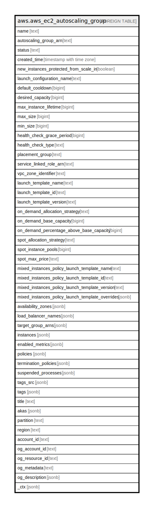

# aws.aws_ec2_autoscaling_group

## Description

AWS EC2 Autoscaling Group

## Columns

| Name | Type | Default | Nullable | Children | Parents | Comment |
| ---- | ---- | ------- | -------- | -------- | ------- | ------- |
| name | text |  | true |  |  | The name of the Auto Scaling group. |
| autoscaling_group_arn | text |  | true |  |  | The Amazon Resource Name (ARN) of the Auto Scaling group. |
| status | text |  | true |  |  | The current state of the group when the DeleteAutoScalingGroup operation is in progress. |
| created_time | timestamp with time zone |  | true |  |  | The date and time group was created. |
| new_instances_protected_from_scale_in | boolean |  | true |  |  | Indicates whether newly launched instances are protected from termination by Amazon EC2 Auto Scaling when scaling in. |
| launch_configuration_name | text |  | true |  |  | The name of the associated launch configuration. |
| default_cooldown | bigint |  | true |  |  | The duration of the default cooldown period, in seconds. |
| desired_capacity | bigint |  | true |  |  | The desired size of the group. |
| max_instance_lifetime | bigint |  | true |  |  | The maximum amount of time, in seconds, that an instance can be in service. |
| max_size | bigint |  | true |  |  | The maximum size of the group. |
| min_size | bigint |  | true |  |  | The minimum size of the group. |
| health_check_grace_period | bigint |  | true |  |  | The amount of time, in seconds, that Amazon EC2 Auto Scaling waits before checking the health status of an EC2 instance that has come into service. |
| health_check_type | text |  | true |  |  | The service to use for the health checks. The valid values are EC2 and ELB. If you configure an Auto Scaling group to use ELB health checks, it considers the instance unhealthy if it fails either the EC2 status checks or the load balancer health checks. |
| placement_group | text |  | true |  |  | The name of the placement group into which to launch your instances, if any. |
| service_linked_role_arn | text |  | true |  |  | The Amazon Resource Name (ARN) of the service-linked role that the Auto Scaling group uses to call other AWS services on your behalf. |
| vpc_zone_identifier | text |  | true |  |  | One or more subnet IDs, if applicable, separated by commas. |
| launch_template_name | text |  | true |  |  | The launch template name for the group. |
| launch_template_id | text |  | true |  |  | The ID of the launch template. |
| launch_template_version | text |  | true |  |  | The version number, $Latest, or $Default. |
| on_demand_allocation_strategy | text |  | true |  |  | Indicates how to allocate instance types to fulfill On-Demand capacity. The only valid value is prioritized, which is also the default value. This strategy uses the order of instance types in the overrides to define the launch priority of each instance type. |
| on_demand_base_capacity | bigint |  | true |  |  | The minimum amount of the Auto Scaling group's capacity that must be fulfilled by On-Demand Instances. This base portion is provisioned first as group scales. Defaults to 0 if not specified. |
| on_demand_percentage_above_base_capacity | bigint |  | true |  |  | Controls the percentages of On-Demand Instances and Spot Instances for your additional capacity beyond OnDemandBaseCapacity. Expressed as a number (for example, 20 specifies 20% On-Demand Instances, 80% Spot Instances). Defaults to 100 if not specified. If set to 100, only On-Demand Instances are provisioned. |
| spot_allocation_strategy | text |  | true |  |  | Indicates how to allocate instances across Spot Instance pools. If the allocation strategy is lowest-price, the Auto Scaling group launches instances using the Spot pools with the lowest price, and evenly allocates your instances across the number of Spot pools that you specify. If the allocation strategy is capacity-optimized, the Auto Scaling group launches instances using Spot pools that are optimally chosen based on the available Spot capacity. Defaults to lowest-price if not specified. |
| spot_instance_pools | bigint |  | true |  |  | The number of Spot Instance pools across which to allocate your Spot Instances. |
| spot_max_price | text |  | true |  |  | The maximum price per unit hour that user is willing to pay for a Spot Instance. If the value of this parameter is blank (which is the default), the maximum Spot price is set at the On-Demand price. |
| mixed_instances_policy_launch_template_name | text |  | true |  |  | The ID of the launch template for mixed instances policy. |
| mixed_instances_policy_launch_template_id | text |  | true |  |  | The name of the launch template for mixed instances policy. |
| mixed_instances_policy_launch_template_version | text |  | true |  |  | The version of the launch template for mixed instances policy. |
| mixed_instances_policy_launch_template_overrides | jsonb |  | true |  |  | Any parameters that is specified in the list override the same parameters in the launch template. |
| availability_zones | jsonb |  | true |  |  | One or more Availability Zones for the group. |
| load_balancer_names | jsonb |  | true |  |  | One or more load balancers associated with the group. |
| target_group_arns | jsonb |  | true |  |  | The Amazon Resource Names (ARN) of the target groups for your load balancer. |
| instances | jsonb |  | true |  |  | The EC2 instances associated with the group. |
| enabled_metrics | jsonb |  | true |  |  | The metrics enabled for the group. |
| policies | jsonb |  | true |  |  | A set of scaling policies for the specified Auto Scaling group. |
| termination_policies | jsonb |  | true |  |  | The termination policies for the group. |
| suspended_processes | jsonb |  | true |  |  | The suspended processes associated with the group. |
| tags_src | jsonb |  | true |  |  | A list of tags assigned to the Auto Scaling Group. |
| tags | jsonb |  | true |  |  | A map of tags for the resource. |
| title | text |  | true |  |  | Title of the resource. |
| akas | jsonb |  | true |  |  | Array of globally unique identifier strings (also known as) for the resource. |
| partition | text |  | true |  |  | The AWS partition in which the resource is located (aws, aws-cn, or aws-us-gov). |
| region | text |  | true |  |  | The AWS Region in which the resource is located. |
| account_id | text |  | true |  |  | The AWS Account ID in which the resource is located. |
| og_account_id | text |  | true |  |  | The Platform Account ID in which the resource is located. |
| og_resource_id | text |  | true |  |  | The unique ID of the resource in opengovernance. |
| og_metadata | text |  | true |  |  | Platform Metadata of the AWS resource. |
| og_description | jsonb |  | true |  |  | The full model description of the resource |
| _ctx | jsonb |  | true |  |  | Steampipe context in JSON form, e.g. connection_name. |

## Relations

---

> Generated by [tbls](https://github.com/k1LoW/tbls)
