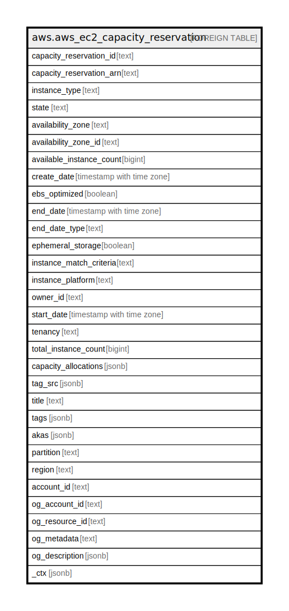

# aws.aws_ec2_capacity_reservation

## Description

AWS EC2 Capacity Reservation

## Columns

| Name | Type | Default | Nullable | Children | Parents | Comment |
| ---- | ---- | ------- | -------- | -------- | ------- | ------- |
| capacity_reservation_id | text |  | true |  |  | The ID of the capacity reservation. |
| capacity_reservation_arn | text |  | true |  |  | The Amazon Resource Name (ARN) of the capacity reservation. |
| instance_type | text |  | true |  |  | The type of instance for which the capacity reservation reserves capacity. |
| state | text |  | true |  |  | The current state of the capacity reservation. A capacity reservation can be in one of the following states: 'active', 'expired', 'cancelled', 'pending', 'failed'. |
| availability_zone | text |  | true |  |  | The availability zone in which the capacity is reserved. |
| availability_zone_id | text |  | true |  |  | The availability zone ID of the capacity reservation. |
| available_instance_count | bigint |  | true |  |  | The remaining capacity. Indicates the number of instances that can be launched in the capacity reservation. |
| create_date | timestamp with time zone |  | true |  |  | The date and time at which the capacity reservation was created. |
| ebs_optimized | boolean |  | true |  |  | Indicates whether the capacity reservation supports EBS-optimized instances. |
| end_date | timestamp with time zone |  | true |  |  | The date and time at which the capacity reservation expires. |
| end_date_type | text |  | true |  |  | Indicates the way in which the capacity reservation ends. A capacity reservation can have one of the following end types: 'unlimited', 'limited'. |
| ephemeral_storage | boolean |  | true |  |  | Indicates whether the capacity reservation supports instances with temporary, block-level storage. |
| instance_match_criteria | text |  | true |  |  | Indicates the type of instance launches that the capacity reservation accepts. The options include: 'open', 'targeted'. |
| instance_platform | text |  | true |  |  | The type of operating system for which the capacity reservation reserves capacity. |
| owner_id | text |  | true |  |  | The ID of the AWS account that owns the capacity reservation. |
| start_date | timestamp with time zone |  | true |  |  | The date and time at which the capacity reservation was started. |
| tenancy | text |  | true |  |  | Indicates the tenancy of the capacity reservation. A capacity reservation can have one of the following tenancy settings: 'default', 'dedicated'. |
| total_instance_count | bigint |  | true |  |  | The total number of instances for which the capacity reservation reserves capacity. |
| capacity_allocations | jsonb |  | true |  |  | Information about instance capacity usage. |
| tag_src | jsonb |  | true |  |  | Any tags assigned to the capacity reservation. |
| title | text |  | true |  |  | Title of the resource. |
| tags | jsonb |  | true |  |  | A map of tags for the resource. |
| akas | jsonb |  | true |  |  | Array of globally unique identifier strings (also known as) for the resource. |
| partition | text |  | true |  |  | The AWS partition in which the resource is located (aws, aws-cn, or aws-us-gov). |
| region | text |  | true |  |  | The AWS Region in which the resource is located. |
| account_id | text |  | true |  |  | The AWS Account ID in which the resource is located. |
| og_account_id | text |  | true |  |  | The Platform Account ID in which the resource is located. |
| og_resource_id | text |  | true |  |  | The unique ID of the resource in opengovernance. |
| og_metadata | text |  | true |  |  | Platform Metadata of the AWS resource. |
| og_description | jsonb |  | true |  |  | The full model description of the resource |
| _ctx | jsonb |  | true |  |  | Steampipe context in JSON form, e.g. connection_name. |

## Relations

---

> Generated by [tbls](https://github.com/k1LoW/tbls)
