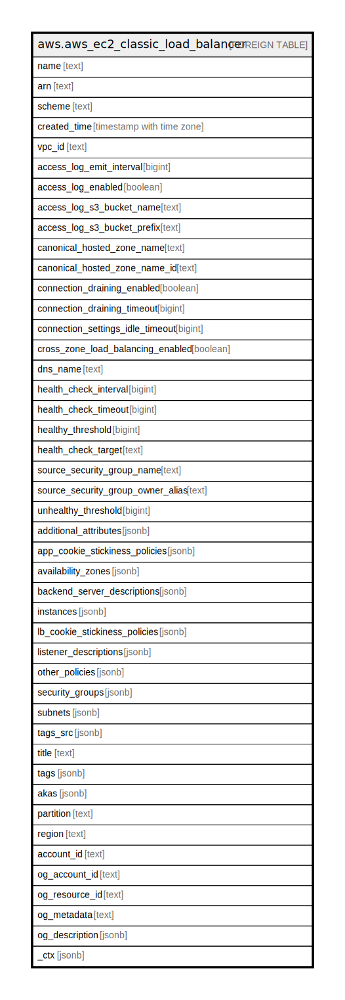

# aws.aws_ec2_classic_load_balancer

## Description

AWS EC2 Classic Load Balancer

## Columns

| Name | Type | Default | Nullable | Children | Parents | Comment |
| ---- | ---- | ------- | -------- | -------- | ------- | ------- |
| name | text |  | true |  |  | The friendly name of the Load Balancer. |
| arn | text |  | true |  |  | The Amazon Resource Name (ARN) specifying the classic load balancer. |
| scheme | text |  | true |  |  | The load balancing scheme of load balancer. |
| created_time | timestamp with time zone |  | true |  |  | The date and time the load balancer was created. |
| vpc_id | text |  | true |  |  | The ID of the VPC for the load balancer. |
| access_log_emit_interval | bigint |  | true |  |  | The interval for publishing the access logs. |
| access_log_enabled | boolean |  | true |  |  | Specifies whether access logs are enabled for the load balancer. |
| access_log_s3_bucket_name | text |  | true |  |  | The name of the Amazon S3 bucket where the access logs are stored. |
| access_log_s3_bucket_prefix | text |  | true |  |  | The logical hierarchy you created for your Amazon S3 bucket. |
| canonical_hosted_zone_name | text |  | true |  |  | The name of the Amazon Route 53 hosted zone for the load balancer. |
| canonical_hosted_zone_name_id | text |  | true |  |  | The ID of the Amazon Route 53 hosted zone for the load balancer. |
| connection_draining_enabled | boolean |  | true |  |  | Specifies whether connection draining is enabled for the load balancer. |
| connection_draining_timeout | bigint |  | true |  |  | The maximum time, in seconds, to keep the existing connections open before deregistering the instances. |
| connection_settings_idle_timeout | bigint |  | true |  |  | The time, in seconds, that the connection is allowed to be idle (no data has been sent over the connection) before it is closed by the load balancer. |
| cross_zone_load_balancing_enabled | boolean |  | true |  |  | Specifies whether cross-zone load balancing is enabled for the load balancer. |
| dns_name | text |  | true |  |  | The DNS name of the load balancer. |
| health_check_interval | bigint |  | true |  |  | The approximate interval, in seconds, between health checks of an individual instance. |
| health_check_timeout | bigint |  | true |  |  | The amount of time, in seconds, during which no response means a failed health check. |
| healthy_threshold | bigint |  | true |  |  | The number of consecutive health checks successes required before moving the instance to the Healthy state. |
| health_check_target | text |  | true |  |  | The instance being checked. The protocol is either TCP, HTTP, HTTPS, or SSL. The range of valid ports is one (1) through 65535. |
| source_security_group_name | text |  | true |  |  | The name of the security group. |
| source_security_group_owner_alias | text |  | true |  |  | The owner of the security group. |
| unhealthy_threshold | bigint |  | true |  |  | The number of consecutive health check failures required before moving the instance to the Unhealthy state. |
| additional_attributes | jsonb |  | true |  |  | A list of additional attributes. |
| app_cookie_stickiness_policies | jsonb |  | true |  |  | A list of the stickiness policies created using CreateAppCookieStickinessPolicy. |
| availability_zones | jsonb |  | true |  |  | A list of the Availability Zones for the load balancer. |
| backend_server_descriptions | jsonb |  | true |  |  | A list of information about your EC2 instances. |
| instances | jsonb |  | true |  |  | A list of the IDs of the instances for the load balancer. |
| lb_cookie_stickiness_policies | jsonb |  | true |  |  | A list of the stickiness policies created using CreateLBCookieStickinessPolicy. |
| listener_descriptions | jsonb |  | true |  |  | A list of the listeners for the load balancer |
| other_policies | jsonb |  | true |  |  | A list of policies other than the stickiness policies. |
| security_groups | jsonb |  | true |  |  | A list of the security groups for the load balancer. |
| subnets | jsonb |  | true |  |  | A list of the IDs of the subnets for the load balancer. |
| tags_src | jsonb |  | true |  |  | A list of tags attached to the load balancer. |
| title | text |  | true |  |  | Title of the resource. |
| tags | jsonb |  | true |  |  | A map of tags for the resource. |
| akas | jsonb |  | true |  |  | Array of globally unique identifier strings (also known as) for the resource. |
| partition | text |  | true |  |  | The AWS partition in which the resource is located (aws, aws-cn, or aws-us-gov). |
| region | text |  | true |  |  | The AWS Region in which the resource is located. |
| account_id | text |  | true |  |  | The AWS Account ID in which the resource is located. |
| og_account_id | text |  | true |  |  | The Platform Account ID in which the resource is located. |
| og_resource_id | text |  | true |  |  | The unique ID of the resource in opengovernance. |
| og_metadata | text |  | true |  |  | Platform Metadata of the AWS resource. |
| og_description | jsonb |  | true |  |  | The full model description of the resource |
| _ctx | jsonb |  | true |  |  | Steampipe context in JSON form, e.g. connection_name. |

## Relations

---

> Generated by [tbls](https://github.com/k1LoW/tbls)
