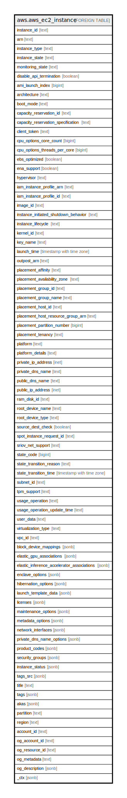

# aws.aws_ec2_instance

## Description

AWS EC2 Instance

## Columns

| Name | Type | Default | Nullable | Children | Parents | Comment |
| ---- | ---- | ------- | -------- | -------- | ------- | ------- |
| instance_id | text |  | true |  |  | The ID of the instance. |
| arn | text |  | true |  |  | The Amazon Resource Name (ARN) specifying the instance. |
| instance_type | text |  | true |  |  | The instance type. |
| instance_state | text |  | true |  |  | The state of the instance (pending | running | shutting-down | terminated | stopping | stopped). |
| monitoring_state | text |  | true |  |  | Indicates whether detailed monitoring is enabled (disabled | enabled). |
| disable_api_termination | boolean |  | true |  |  | If the value is true, instance can't be terminated through the Amazon EC2 console, CLI, or API. |
| ami_launch_index | bigint |  | true |  |  | The AMI launch index, which can be used to find this instance in the launch group. |
| architecture | text |  | true |  |  | The architecture of the image. |
| boot_mode | text |  | true |  |  | The boot mode of the instance. |
| capacity_reservation_id | text |  | true |  |  | The ID of the Capacity Reservation. |
| capacity_reservation_specification | text |  | true |  |  | Information about the Capacity Reservation targeting option. |
| client_token | text |  | true |  |  | The idempotency token you provided when you launched the instance, if applicable. |
| cpu_options_core_count | bigint |  | true |  |  | The number of CPU cores for the instance. |
| cpu_options_threads_per_core | bigint |  | true |  |  | The number of threads per CPU core. |
| ebs_optimized | boolean |  | true |  |  | Indicates whether the instance is optimized for Amazon EBS I/O. This optimization provides dedicated throughput to Amazon EBS and an optimized configuration stack to provide optimal I/O performance. This optimization isn't available with all instance types. |
| ena_support | boolean |  | true |  |  | Specifies whether enhanced networking with ENA is enabled. |
| hypervisor | text |  | true |  |  | The hypervisor type of the instance. The value xen is used for both Xen and Nitro hypervisors. |
| iam_instance_profile_arn | text |  | true |  |  | The Amazon Resource Name (ARN) of IAM instance profile associated with the instance, if applicable. |
| iam_instance_profile_id | text |  | true |  |  | The ID of the instance profile associated with the instance, if applicable. |
| image_id | text |  | true |  |  | The ID of the AMI used to launch the instance. |
| instance_initiated_shutdown_behavior | text |  | true |  |  | Indicates whether an instance stops or terminates when you initiate shutdown from the instance (using the operating system command for system shutdown). |
| instance_lifecycle | text |  | true |  |  | Indicates whether this is a spot instance or a scheduled instance. |
| kernel_id | text |  | true |  |  | The kernel ID |
| key_name | text |  | true |  |  | The name of the key pair, if this instance was launched with an associated key pair. |
| launch_time | timestamp with time zone |  | true |  |  | The time the instance was launched. |
| outpost_arn | text |  | true |  |  | The Amazon Resource Name (ARN) of the Outpost, if applicable. |
| placement_affinity | text |  | true |  |  | The affinity setting for the instance on the Dedicated Host. |
| placement_availability_zone | text |  | true |  |  | The Availability Zone of the instance. |
| placement_group_id | text |  | true |  |  | The ID of the placement group that the instance is in. |
| placement_group_name | text |  | true |  |  | The name of the placement group the instance is in. |
| placement_host_id | text |  | true |  |  | The ID of the Dedicated Host on which the instance resides. |
| placement_host_resource_group_arn | text |  | true |  |  | The ARN of the host resource group in which to launch the instances. |
| placement_partition_number | bigint |  | true |  |  | The ARN of the host resource group in which to launch the instances. |
| placement_tenancy | text |  | true |  |  | The tenancy of the instance (if the instance is running in a VPC). An instance with a tenancy of dedicated runs on single-tenant hardware. |
| platform | text |  | true |  |  | The value is 'Windows' for Windows instances; otherwise blank. |
| platform_details | text |  | true |  |  | The platform details value for the instance. |
| private_ip_address | inet |  | true |  |  | The private IPv4 address assigned to the instance. |
| private_dns_name | text |  | true |  |  | The private DNS hostname name assigned to the instance. This DNS hostname can only be used inside the Amazon EC2 network. This name is not available until the instance enters the running state. |
| public_dns_name | text |  | true |  |  | The public DNS name assigned to the instance. This name is not available until the instance enters the running state. |
| public_ip_address | inet |  | true |  |  | The public IPv4 address, or the Carrier IP address assigned to the instance, if applicable. |
| ram_disk_id | text |  | true |  |  | The RAM disk ID. |
| root_device_name | text |  | true |  |  | The device name of the root device volume (for example, /dev/sda1). |
| root_device_type | text |  | true |  |  | The root device type used by the AMI. The AMI can use an EBS volume or an instance store volume. |
| source_dest_check | boolean |  | true |  |  | Specifies whether to enable an instance launched in a VPC to perform NAT. This controls whether source/destination checking is enabled on the instance. |
| spot_instance_request_id | text |  | true |  |  | If the request is a Spot Instance request, the ID of the request. |
| sriov_net_support | text |  | true |  |  | Indicates whether enhanced networking with the Intel 82599 Virtual Function interface is enabled. |
| state_code | bigint |  | true |  |  | The reason code for the state change. |
| state_transition_reason | text |  | true |  |  | The reason for the most recent state transition. |
| state_transition_time | timestamp with time zone |  | true |  |  | The date and time, the instance state was last modified. |
| subnet_id | text |  | true |  |  | The ID of the subnet in which the instance is running. |
| tpm_support | text |  | true |  |  | If the instance is configured for NitroTPM support, the value is v2.0. |
| usage_operation | text |  | true |  |  | The usage operation value for the instance. |
| usage_operation_update_time | text |  | true |  |  | The time that the usage operation was last updated. |
| user_data | text |  | true |  |  | The user data of the instance. |
| virtualization_type | text |  | true |  |  | The virtualization type of the instance. |
| vpc_id | text |  | true |  |  | The ID of the VPC in which the instance is running. |
| block_device_mappings | jsonb |  | true |  |  | Block device mapping entries for the instance. |
| elastic_gpu_associations | jsonb |  | true |  |  | The Elastic GPU associated with the instance. |
| elastic_inference_accelerator_associations | jsonb |  | true |  |  | The elastic inference accelerator associated with the instance. |
| enclave_options | jsonb |  | true |  |  | Indicates whether the instance is enabled for Amazon Web Services Nitro Enclaves. |
| hibernation_options | jsonb |  | true |  |  | Indicates whether the instance is enabled for hibernation. |
| launch_template_data | jsonb |  | true |  |  | The configuration data of the specified instance. |
| licenses | jsonb |  | true |  |  | The license configurations for the instance. |
| maintenance_options | jsonb |  | true |  |  | The metadata options for the instance. |
| metadata_options | jsonb |  | true |  |  | The metadata options for the instance. |
| network_interfaces | jsonb |  | true |  |  | The network interfaces for the instance. |
| private_dns_name_options | jsonb |  | true |  |  | The options for the instance hostname. |
| product_codes | jsonb |  | true |  |  | The product codes attached to this instance, if applicable. |
| security_groups | jsonb |  | true |  |  | The security groups for the instance. |
| instance_status | jsonb |  | true |  |  | The status of an instance. Instance status includes scheduled events, status checks and instance state information. |
| tags_src | jsonb |  | true |  |  | A list of tags assigned to the instance. |
| title | text |  | true |  |  | Title of the resource. |
| tags | jsonb |  | true |  |  | A map of tags for the resource. |
| akas | jsonb |  | true |  |  | Array of globally unique identifier strings (also known as) for the resource. |
| partition | text |  | true |  |  | The AWS partition in which the resource is located (aws, aws-cn, or aws-us-gov). |
| region | text |  | true |  |  | The AWS Region in which the resource is located. |
| account_id | text |  | true |  |  | The AWS Account ID in which the resource is located. |
| og_account_id | text |  | true |  |  | The Platform Account ID in which the resource is located. |
| og_resource_id | text |  | true |  |  | The unique ID of the resource in opengovernance. |
| og_metadata | text |  | true |  |  | Platform Metadata of the AWS resource. |
| og_description | jsonb |  | true |  |  | The full model description of the resource |
| _ctx | jsonb |  | true |  |  | Steampipe context in JSON form, e.g. connection_name. |

## Relations

---

> Generated by [tbls](https://github.com/k1LoW/tbls)
