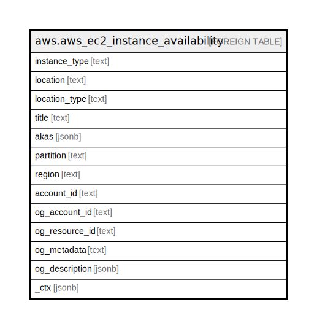

# aws.aws_ec2_instance_availability

## Description

AWS EC2 Instance Availability

## Columns

| Name | Type | Default | Nullable | Children | Parents | Comment |
| ---- | ---- | ------- | -------- | -------- | ------- | ------- |
| instance_type | text |  | true |  |  | The instance type. For more information, see [ Instance Types ](https://docs.aws.amazon.com/AWSEC2/latest/UserGuide/instance-types.html) in the Amazon Elastic Compute Cloud User Guide. |
| location | text |  | true |  |  | The identifier for the location. This depends on the location type. For example, if the location type is region, the location is the Region code (for example, us-east-2.) |
| location_type | text |  | true |  |  | The type of location. |
| title | text |  | true |  |  | Title of the resource. |
| akas | jsonb |  | true |  |  | Array of globally unique identifier strings (also known as) for the resource. |
| partition | text |  | true |  |  | The AWS partition in which the resource is located (aws, aws-cn, or aws-us-gov). |
| region | text |  | true |  |  | The AWS Region in which the resource is located. |
| account_id | text |  | true |  |  | The AWS Account ID in which the resource is located. |
| og_account_id | text |  | true |  |  | The Platform Account ID in which the resource is located. |
| og_resource_id | text |  | true |  |  | The unique ID of the resource in opengovernance. |
| og_metadata | text |  | true |  |  | Platform Metadata of the AWS resource. |
| og_description | jsonb |  | true |  |  | The full model description of the resource |
| _ctx | jsonb |  | true |  |  | Steampipe context in JSON form, e.g. connection_name. |

## Relations

---

> Generated by [tbls](https://github.com/k1LoW/tbls)
