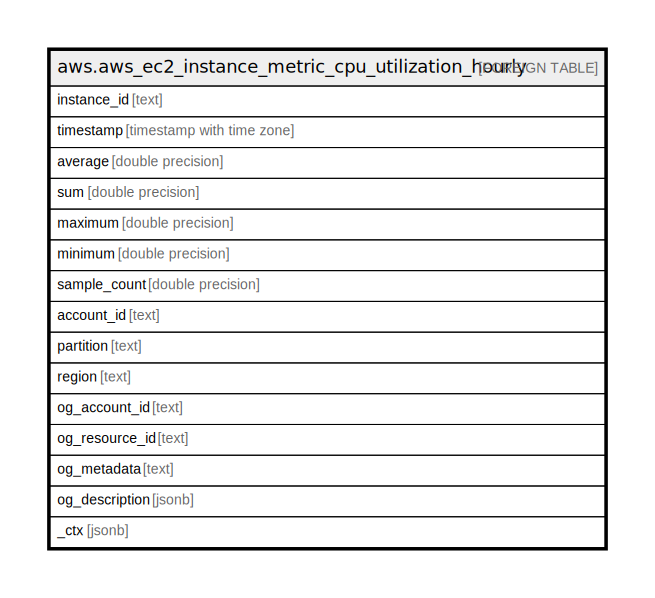

# aws.aws_ec2_instance_metric_cpu_utilization_hourly

## Description

AWS EC2 Instance Cloudwatch Metrics - CPU Utilization (Hourly)

## Columns

| Name | Type | Default | Nullable | Children | Parents | Comment |
| ---- | ---- | ------- | -------- | -------- | ------- | ------- |
| instance_id | text |  | true |  |  | The ID of the instance. |
| timestamp | timestamp with time zone |  | true |  |  | Datapoint Timestamp. |
| average | double precision |  | true |  |  | Sample Average. |
| sum | double precision |  | true |  |  | Sample Sum. |
| maximum | double precision |  | true |  |  | Sample Maximum. |
| minimum | double precision |  | true |  |  | Sample Minimum. |
| sample_count | double precision |  | true |  |  | Sample Count. |
| account_id | text |  | true |  |  | Account Id of the resource |
| partition | text |  | true |  |  | The AWS partition in which the resource is located (aws, aws-cn, or aws-us-gov). |
| region | text |  | true |  |  | The AWS Region in which the resource is located. |
| og_account_id | text |  | true |  |  | The Platform Account ID in which the resource is located. |
| og_resource_id | text |  | true |  |  | The unique ID of the resource in opengovernance. |
| og_metadata | text |  | true |  |  | Platform Metadata of the AWS resource. |
| og_description | jsonb |  | true |  |  | The full model description of the resource |
| _ctx | jsonb |  | true |  |  | Steampipe context in JSON form, e.g. connection_name. |

## Relations

---

> Generated by [tbls](https://github.com/k1LoW/tbls)
