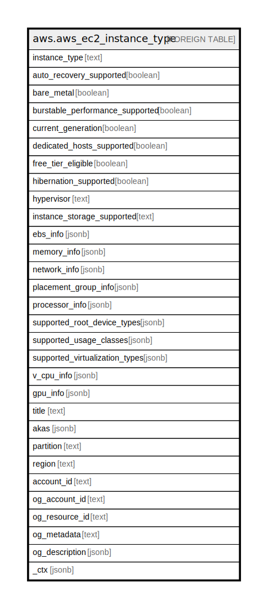

# aws.aws_ec2_instance_type

## Description

AWS EC2 Instance Type

## Columns

| Name | Type | Default | Nullable | Children | Parents | Comment |
| ---- | ---- | ------- | -------- | -------- | ------- | ------- |
| instance_type | text |  | true |  |  | The instance type. For more information, see [ Instance Types ](https://docs.aws.amazon.com/AWSEC2/latest/UserGuide/instance-types.html) in the Amazon Elastic Compute Cloud User Guide. |
| auto_recovery_supported | boolean |  | true |  |  | Indicates whether auto recovery is supported. |
| bare_metal | boolean |  | true |  |  | Indicates whether the instance is a bare metal instance type. |
| burstable_performance_supported | boolean |  | true |  |  | Indicates whether the instance type is a burstable performance instance type. |
| current_generation | boolean |  | true |  |  | Indicates whether the instance type is current generation. |
| dedicated_hosts_supported | boolean |  | true |  |  | Indicates whether Dedicated Hosts are supported on the instance type. |
| free_tier_eligible | boolean |  | true |  |  | Indicates whether the instance type is eligible for the free tier. |
| hibernation_supported | boolean |  | true |  |  | Indicates whether On-Demand hibernation is supported. |
| hypervisor | text |  | true |  |  | The hypervisor for the instance type. |
| instance_storage_supported | text |  | true |  |  | Describes the instance storage for the instance type. |
| ebs_info | jsonb |  | true |  |  | Describes the Amazon EBS settings for the instance type. |
| memory_info | jsonb |  | true |  |  | Describes the memory for the instance type. |
| network_info | jsonb |  | true |  |  | Describes the network settings for the instance type. |
| placement_group_info | jsonb |  | true |  |  | Describes the placement group settings for the instance type. |
| processor_info | jsonb |  | true |  |  | Describes the processor. |
| supported_root_device_types | jsonb |  | true |  |  | The supported root device types. |
| supported_usage_classes | jsonb |  | true |  |  | Indicates whether the instance type is offered for spot or On-Demand. |
| supported_virtualization_types | jsonb |  | true |  |  | The supported virtualization types. |
| v_cpu_info | jsonb |  | true |  |  | Describes the vCPU configurations for the instance type. |
| gpu_info | jsonb |  | true |  |  | Describes the GPU accelerator settings for the instance type. |
| title | text |  | true |  |  | Title of the resource. |
| akas | jsonb |  | true |  |  | Array of globally unique identifier strings (also known as) for the resource. |
| partition | text |  | true |  |  | The AWS partition in which the resource is located (aws, aws-cn, or aws-us-gov). |
| region | text |  | true |  |  | The AWS Region in which the resource is located. |
| account_id | text |  | true |  |  | The AWS Account ID in which the resource is located. |
| og_account_id | text |  | true |  |  | The Platform Account ID in which the resource is located. |
| og_resource_id | text |  | true |  |  | The unique ID of the resource in opengovernance. |
| og_metadata | text |  | true |  |  | Platform Metadata of the AWS resource. |
| og_description | jsonb |  | true |  |  | The full model description of the resource |
| _ctx | jsonb |  | true |  |  | Steampipe context in JSON form, e.g. connection_name. |

## Relations

---

> Generated by [tbls](https://github.com/k1LoW/tbls)
