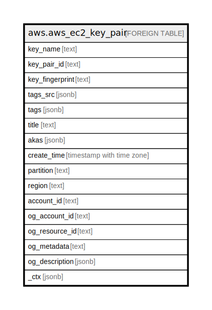

# aws.aws_ec2_key_pair

## Description

AWS EC2 Key Pair

## Columns

| Name | Type | Default | Nullable | Children | Parents | Comment |
| ---- | ---- | ------- | -------- | -------- | ------- | ------- |
| key_name | text |  | true |  |  | The name of the key pair |
| key_pair_id | text |  | true |  |  | The ID of the key pair |
| key_fingerprint | text |  | true |  |  | If key pair was created using CreateKeyPair, this is the SHA-1 digest of the DER encoded private key. If key pair was created using ImportKeyPair to provide AWS the public key, this is the MD5 public key fingerprint as specified in section 4 of RFC4716 |
| tags_src | jsonb |  | true |  |  | A list of tags assigned to the key pair |
| tags | jsonb |  | true |  |  | A map of tags for the resource. |
| title | text |  | true |  |  | Title of the resource. |
| akas | jsonb |  | true |  |  | Array of globally unique identifier strings (also known as) for the resource. |
| create_time | timestamp with time zone |  | true |  |  | The time that the keypair was created or imported |
| partition | text |  | true |  |  | The AWS partition in which the resource is located (aws, aws-cn, or aws-us-gov). |
| region | text |  | true |  |  | The AWS Region in which the resource is located. |
| account_id | text |  | true |  |  | The AWS Account ID in which the resource is located. |
| og_account_id | text |  | true |  |  | The Platform Account ID in which the resource is located. |
| og_resource_id | text |  | true |  |  | The unique ID of the resource in opengovernance. |
| og_metadata | text |  | true |  |  | Platform Metadata of the AWS resource. |
| og_description | jsonb |  | true |  |  | The full model description of the resource |
| _ctx | jsonb |  | true |  |  | Steampipe context in JSON form, e.g. connection_name. |

## Relations

---

> Generated by [tbls](https://github.com/k1LoW/tbls)
