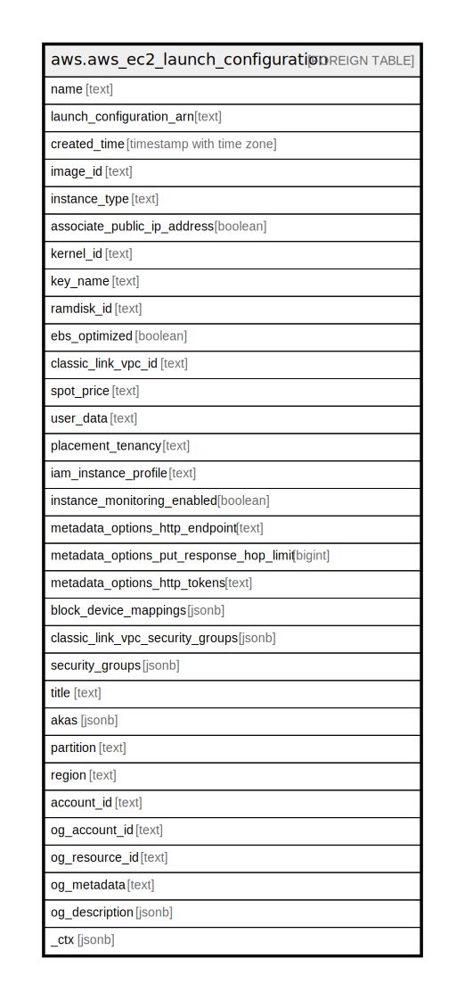

# aws.aws_ec2_launch_configuration

## Description

AWS EC2 Launch Configuration

## Columns

| Name | Type | Default | Nullable | Children | Parents | Comment |
| ---- | ---- | ------- | -------- | -------- | ------- | ------- |
| name | text |  | true |  |  | The name of the launch configuration. |
| launch_configuration_arn | text |  | true |  |  | The Amazon Resource Name (ARN) of the launch configuration. |
| created_time | timestamp with time zone |  | true |  |  | The creation date and time for the launch configuration. |
| image_id | text |  | true |  |  | The ID of the Amazon Machine Image (AMI) to use to launch EC2 instances. |
| instance_type | text |  | true |  |  | The instance type for the instances. |
| associate_public_ip_address | boolean |  | true |  |  | For Auto Scaling groups that are running in a VPC, specifies whether to assign a public IP address to the group's instances. |
| kernel_id | text |  | true |  |  | The ID of the kernel associated with the AMI. |
| key_name | text |  | true |  |  | The name of the key pair to be associated with instances. |
| ramdisk_id | text |  | true |  |  | The ID of the RAM disk associated with the AMI. |
| ebs_optimized | boolean |  | true |  |  | Specifies whether the launch configuration is optimized for EBS I/O (true) or not (false). |
| classic_link_vpc_id | text |  | true |  |  | The ID of a ClassicLink-enabled VPC to link EC2-Classic instances to. |
| spot_price | text |  | true |  |  | The maximum hourly price to be paid for any Spot Instance launched to fulfill the request. Spot Instances are launched when the price you specified exceeds the current Spot price. |
| user_data | text |  | true |  |  | The Base64-encoded user data to make available to the launched EC2 instances. |
| placement_tenancy | text |  | true |  |  | The tenancy of the instance, either default or dedicated. An instance with dedicated tenancy runs on isolated, single-tenant hardware and can only be launched into a VPC. |
| iam_instance_profile | text |  | true |  |  | The name or the Amazon Resource Name (ARN) of the instance profile associated with the IAM role for the instance. |
| instance_monitoring_enabled | boolean |  | true |  |  | Describes whether detailed monitoring is enabled for the Auto Scaling instances. |
| metadata_options_http_endpoint | text |  | true |  |  | This parameter enables or disables the HTTP metadata endpoint on instances. If the parameter is not specified, the default state is enabled. |
| metadata_options_put_response_hop_limit | bigint |  | true |  |  | The desired HTTP PUT response hop limit for instance metadata requests. The larger the number, the further instance metadata requests can travel. |
| metadata_options_http_tokens | text |  | true |  |  | The state of token usage for your instance metadata requests. If the parameter is not specified in the request, the default state is optional. |
| block_device_mappings | jsonb |  | true |  |  | A block device mapping, which specifies the block devices for the instance. |
| classic_link_vpc_security_groups | jsonb |  | true |  |  | The IDs of one or more security groups for the VPC specified in ClassicLinkVPCId. |
| security_groups | jsonb |  | true |  |  | A list that contains the security groups to assign to the instances in the Auto Scaling group. |
| title | text |  | true |  |  | Title of the resource. |
| akas | jsonb |  | true |  |  | Array of globally unique identifier strings (also known as) for the resource. |
| partition | text |  | true |  |  | The AWS partition in which the resource is located (aws, aws-cn, or aws-us-gov). |
| region | text |  | true |  |  | The AWS Region in which the resource is located. |
| account_id | text |  | true |  |  | The AWS Account ID in which the resource is located. |
| og_account_id | text |  | true |  |  | The Platform Account ID in which the resource is located. |
| og_resource_id | text |  | true |  |  | The unique ID of the resource in opengovernance. |
| og_metadata | text |  | true |  |  | Platform Metadata of the AWS resource. |
| og_description | jsonb |  | true |  |  | The full model description of the resource |
| _ctx | jsonb |  | true |  |  | Steampipe context in JSON form, e.g. connection_name. |

## Relations

---

> Generated by [tbls](https://github.com/k1LoW/tbls)
