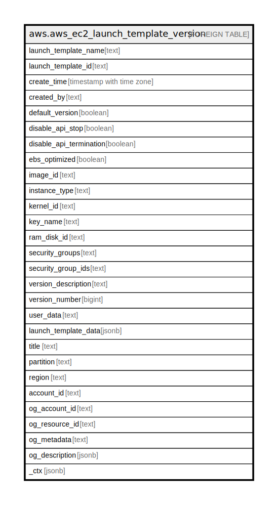

# aws.aws_ec2_launch_template_version

## Description

AWS EC2 Launch Template Version

## Columns

| Name | Type | Default | Nullable | Children | Parents | Comment |
| ---- | ---- | ------- | -------- | -------- | ------- | ------- |
| launch_template_name | text |  | true |  |  | The name of the launch template. |
| launch_template_id | text |  | true |  |  | The ID of the launch template. |
| create_time | timestamp with time zone |  | true |  |  | The time the version was created. |
| created_by | text |  | true |  |  | The principal that created the version. |
| default_version | boolean |  | true |  |  | Indicates whether the version is the default version. |
| disable_api_stop | boolean |  | true |  |  | Indicates whether the instance is enabled for stop protection. |
| disable_api_termination | boolean |  | true |  |  | If set to true, indicates that the instance cannot be terminated using the Amazon EC2 console, command line tool, or API. |
| ebs_optimized | boolean |  | true |  |  | Indicates whether the instance is optimized for Amazon EBS I/O. |
| image_id | text |  | true |  |  | The ID of the AMI or a Systems Manager parameter. |
| instance_type | text |  | true |  |  | The instance type. |
| kernel_id | text |  | true |  |  | The ID of the kernel, if applicable. |
| key_name | text |  | true |  |  | The name of the key pair. |
| ram_disk_id | text |  | true |  |  | The ID of the RAM disk, if applicable. |
| security_groups | text |  | true |  |  | The security group names. |
| security_group_ids | text |  | true |  |  | The security group IDs. |
| version_description | text |  | true |  |  | The description for the version. |
| version_number | bigint |  | true |  |  | The version number. |
| user_data | text |  | true |  |  | The user data of the launch template. |
| launch_template_data | jsonb |  | true |  |  | Information about the launch template. |
| title | text |  | true |  |  | Title of the resource. |
| partition | text |  | true |  |  | The AWS partition in which the resource is located (aws, aws-cn, or aws-us-gov). |
| region | text |  | true |  |  | The AWS Region in which the resource is located. |
| account_id | text |  | true |  |  | The AWS Account ID in which the resource is located. |
| og_account_id | text |  | true |  |  | The Platform Account ID in which the resource is located. |
| og_resource_id | text |  | true |  |  | The unique ID of the resource in opengovernance. |
| og_metadata | text |  | true |  |  | Platform Metadata of the AWS resource. |
| og_description | jsonb |  | true |  |  | The full model description of the resource |
| _ctx | jsonb |  | true |  |  | Steampipe context in JSON form, e.g. connection_name. |

## Relations

---

> Generated by [tbls](https://github.com/k1LoW/tbls)
