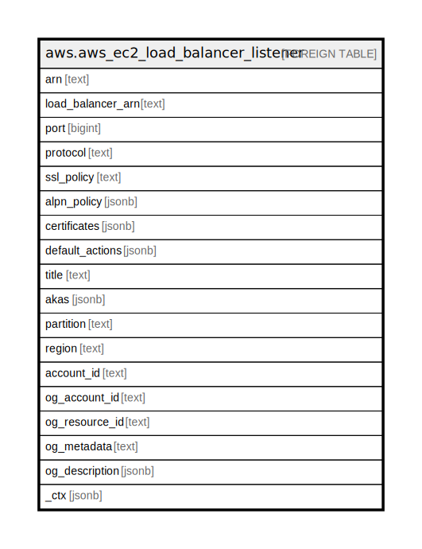

# aws.aws_ec2_load_balancer_listener

## Description

AWS EC2 Load Balancer Listener

## Columns

| Name | Type | Default | Nullable | Children | Parents | Comment |
| ---- | ---- | ------- | -------- | -------- | ------- | ------- |
| arn | text |  | true |  |  | The Amazon Resource Name (ARN) of the listener. |
| load_balancer_arn | text |  | true |  |  | The Amazon Resource Name (ARN) of the load balancer. |
| port | bigint |  | true |  |  | The port on which the load balancer is listening. |
| protocol | text |  | true |  |  | The protocol for connections from clients to the load balancer. |
| ssl_policy | text |  | true |  |  | The security policy that defines which protocols and ciphers are supported. |
| alpn_policy | jsonb |  | true |  |  | The name of the Application-Layer Protocol Negotiation (ALPN) policy. |
| certificates | jsonb |  | true |  |  | The default certificate for the listener. |
| default_actions | jsonb |  | true |  |  | The default actions for the listener. |
| title | text |  | true |  |  | Title of the resource. |
| akas | jsonb |  | true |  |  | Array of globally unique identifier strings (also known as) for the resource. |
| partition | text |  | true |  |  | The AWS partition in which the resource is located (aws, aws-cn, or aws-us-gov). |
| region | text |  | true |  |  | The AWS Region in which the resource is located. |
| account_id | text |  | true |  |  | The AWS Account ID in which the resource is located. |
| og_account_id | text |  | true |  |  | The Platform Account ID in which the resource is located. |
| og_resource_id | text |  | true |  |  | The unique ID of the resource in opengovernance. |
| og_metadata | text |  | true |  |  | Platform Metadata of the AWS resource. |
| og_description | jsonb |  | true |  |  | The full model description of the resource |
| _ctx | jsonb |  | true |  |  | Steampipe context in JSON form, e.g. connection_name. |

## Relations

---

> Generated by [tbls](https://github.com/k1LoW/tbls)
