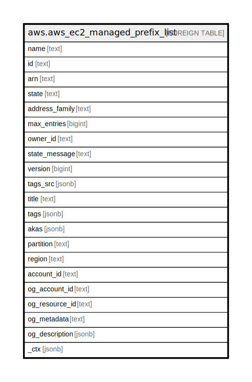

# aws.aws_ec2_managed_prefix_list

## Description

AWS EC2 Managed Prefix List

## Columns

| Name | Type | Default | Nullable | Children | Parents | Comment |
| ---- | ---- | ------- | -------- | -------- | ------- | ------- |
| name | text |  | true |  |  | The name of the prefix list. |
| id | text |  | true |  |  | The ID of the prefix list. |
| arn | text |  | true |  |  | The Amazon Resource Name (ARN) for the prefix list. |
| state | text |  | true |  |  | The current state of the prefix list. |
| address_family | text |  | true |  |  | The IP address version of the prefix list. |
| max_entries | bigint |  | true |  |  | The maximum number of entries for the prefix list. |
| owner_id | text |  | true |  |  | The ID of the owner of the prefix list. |
| state_message | text |  | true |  |  | The message regarding the current state of the prefix list. |
| version | bigint |  | true |  |  | The version of the prefix list. |
| tags_src | jsonb |  | true |  |  | The tags for the prefix list. |
| title | text |  | true |  |  | Title of the resource. |
| tags | jsonb |  | true |  |  | A map of tags for the resource. |
| akas | jsonb |  | true |  |  | Array of globally unique identifier strings (also known as) for the resource. |
| partition | text |  | true |  |  | The AWS partition in which the resource is located (aws, aws-cn, or aws-us-gov). |
| region | text |  | true |  |  | The AWS Region in which the resource is located. |
| account_id | text |  | true |  |  | The AWS Account ID in which the resource is located. |
| og_account_id | text |  | true |  |  | The Platform Account ID in which the resource is located. |
| og_resource_id | text |  | true |  |  | The unique ID of the resource in opengovernance. |
| og_metadata | text |  | true |  |  | Platform Metadata of the AWS resource. |
| og_description | jsonb |  | true |  |  | The full model description of the resource |
| _ctx | jsonb |  | true |  |  | Steampipe context in JSON form, e.g. connection_name. |

## Relations

---

> Generated by [tbls](https://github.com/k1LoW/tbls)
