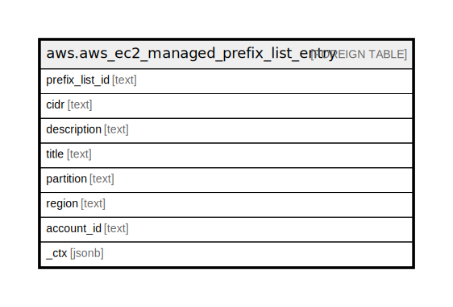

# aws.aws_ec2_managed_prefix_list_entry

## Description

AWS EC2 Managed Prefix List Entry

## Columns

| Name | Type | Default | Nullable | Children | Parents | Comment |
| ---- | ---- | ------- | -------- | -------- | ------- | ------- |
| prefix_list_id | text |  | true |  |  | The ID of the prefix list. |
| cidr | text |  | true |  |  | The CIDR block. |
| description | text |  | true |  |  | The description of the entry. |
| title | text |  | true |  |  | Title of the resource. |
| partition | text |  | true |  |  | The AWS partition in which the resource is located (aws, aws-cn, or aws-us-gov). |
| region | text |  | true |  |  | The AWS Region in which the resource is located. |
| account_id | text |  | true |  |  | The AWS Account ID in which the resource is located. |
| _ctx | jsonb |  | true |  |  | Steampipe context in JSON form, e.g. connection_name. |

## Relations

---

> Generated by [tbls](https://github.com/k1LoW/tbls)
