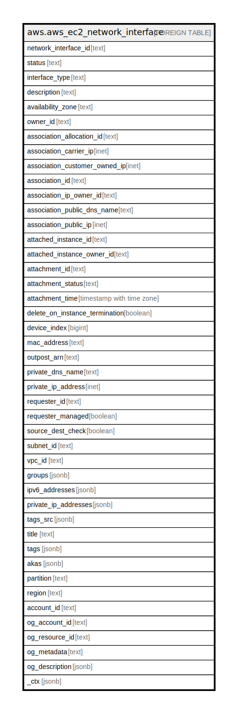

# aws.aws_ec2_network_interface

## Description

AWS EC2 Network Interface

## Columns

| Name | Type | Default | Nullable | Children | Parents | Comment |
| ---- | ---- | ------- | -------- | -------- | ------- | ------- |
| network_interface_id | text |  | true |  |  | The ID of the network interface. |
| status | text |  | true |  |  | The status of the network interface. |
| interface_type | text |  | true |  |  | The type of network interface. |
| description | text |  | true |  |  | A description. |
| availability_zone | text |  | true |  |  | The Availability Zone. |
| owner_id | text |  | true |  |  | The AWS account ID of the owner of the network interface. |
| association_allocation_id | text |  | true |  |  | Allocation id for the association. Association can be an Elastic IP address (IPv4 only), or a Carrier IP address. |
| association_carrier_ip | inet |  | true |  |  | The carrier IP address associated with the network interface. |
| association_customer_owned_ip | inet |  | true |  |  | The customer-owned IP address associated with the network interface. |
| association_id | text |  | true |  |  | The association ID. |
| association_ip_owner_id | text |  | true |  |  | The ID of the Elastic IP address owner. |
| association_public_dns_name | text |  | true |  |  | The public DNS name of the association. |
| association_public_ip | inet |  | true |  |  | The address of the Elastic IP address bound to the network interface. |
| attached_instance_id | text |  | true |  |  | The ID of the attached instance. |
| attached_instance_owner_id | text |  | true |  |  | The AWS account ID of the owner of the attached instance. |
| attachment_id | text |  | true |  |  | The ID of the network interface attachment. |
| attachment_status | text |  | true |  |  | The attachment state. |
| attachment_time | timestamp with time zone |  | true |  |  | The timestamp indicating when the attachment initiated. |
| delete_on_instance_termination | boolean |  | true |  |  | Indicates whether the network interface is deleted when the instance is terminated. |
| device_index | bigint |  | true |  |  | The device index of the network interface attachment on the instance. |
| mac_address | text |  | true |  |  | The MAC address of the interface. |
| outpost_arn | text |  | true |  |  | The Amazon Resource Name (ARN) of the Outpost, if applicable. |
| private_dns_name | text |  | true |  |  | The private DNS name |
| private_ip_address | inet |  | true |  |  | The IPv4 address of the network interface within the subnet. |
| requester_id | text |  | true |  |  | The ID of the entity that launched the instance on your behalf (for example, AWS Management Console or Auto Scaling). |
| requester_managed | boolean |  | true |  |  | Indicates whether the network interface is being managed by AWS. |
| source_dest_check | boolean |  | true |  |  | Indicates whether traffic to or from the instance is validated. |
| subnet_id | text |  | true |  |  | The ID of the subnet. |
| vpc_id | text |  | true |  |  | The ID of the VPC. |
| groups | jsonb |  | true |  |  | Any security groups for the network interface. |
| ipv6_addresses | jsonb |  | true |  |  | The IPv6 addresses associated with the network interface. |
| private_ip_addresses | jsonb |  | true |  |  | The IPv4 address of the network interface within the subnet. |
| tags_src | jsonb |  | true |  |  | A list of tags that are attached to the network interface. |
| title | text |  | true |  |  | Title of the resource. |
| tags | jsonb |  | true |  |  | A map of tags for the resource. |
| akas | jsonb |  | true |  |  | Array of globally unique identifier strings (also known as) for the resource. |
| partition | text |  | true |  |  | The AWS partition in which the resource is located (aws, aws-cn, or aws-us-gov). |
| region | text |  | true |  |  | The AWS Region in which the resource is located. |
| account_id | text |  | true |  |  | The AWS Account ID in which the resource is located. |
| og_account_id | text |  | true |  |  | The Platform Account ID in which the resource is located. |
| og_resource_id | text |  | true |  |  | The unique ID of the resource in opengovernance. |
| og_metadata | text |  | true |  |  | Platform Metadata of the AWS resource. |
| og_description | jsonb |  | true |  |  | The full model description of the resource |
| _ctx | jsonb |  | true |  |  | Steampipe context in JSON form, e.g. connection_name. |

## Relations

---

> Generated by [tbls](https://github.com/k1LoW/tbls)
