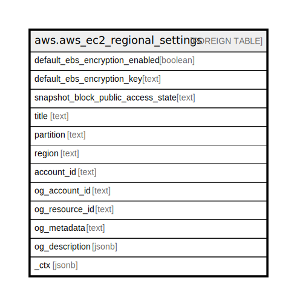

# aws.aws_ec2_regional_settings

## Description

AWS EC2 Regional Settings

## Columns

| Name | Type | Default | Nullable | Children | Parents | Comment |
| ---- | ---- | ------- | -------- | -------- | ------- | ------- |
| default_ebs_encryption_enabled | boolean |  | true |  |  | Indicates whether encryption by default is enabled. |
| default_ebs_encryption_key | text |  | true |  |  | The Amazon Resource Name (ARN) or alias of the default CMK for encryption by default. |
| snapshot_block_public_access_state | text |  | true |  |  | Gets the current state of block public access for snapshots setting for the account and Region. |
| title | text |  | true |  |  | Title of the resource. |
| partition | text |  | true |  |  | The AWS partition in which the resource is located (aws, aws-cn, or aws-us-gov). |
| region | text |  | true |  |  | The AWS Region in which the resource is located. |
| account_id | text |  | true |  |  | The AWS Account ID in which the resource is located. |
| og_account_id | text |  | true |  |  | The Platform Account ID in which the resource is located. |
| og_resource_id | text |  | true |  |  | The unique ID of the resource in opengovernance. |
| og_metadata | text |  | true |  |  | Platform Metadata of the AWS resource. |
| og_description | jsonb |  | true |  |  | The full model description of the resource |
| _ctx | jsonb |  | true |  |  | Steampipe context in JSON form, e.g. connection_name. |

## Relations

---

> Generated by [tbls](https://github.com/k1LoW/tbls)
