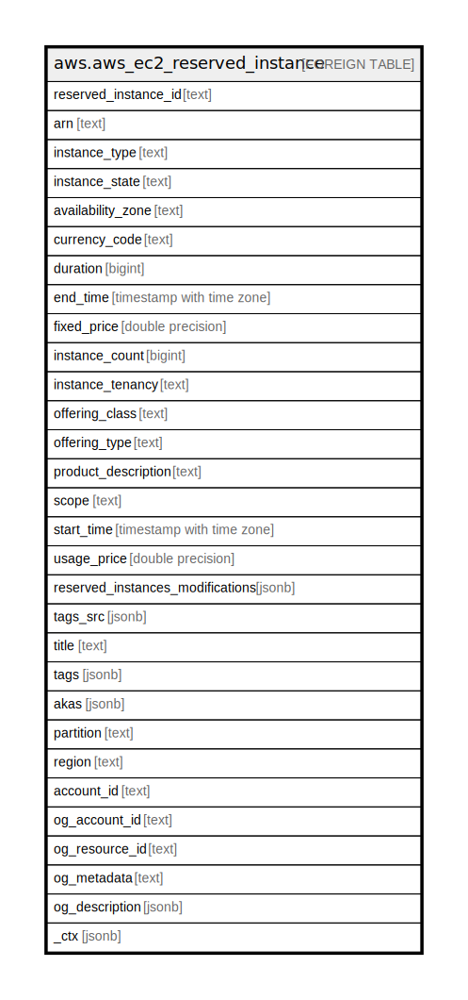

# aws.aws_ec2_reserved_instance

## Description

AWS EC2 Reserved Instance

## Columns

| Name | Type | Default | Nullable | Children | Parents | Comment |
| ---- | ---- | ------- | -------- | -------- | ------- | ------- |
| reserved_instance_id | text |  | true |  |  | The ID of the Reserved instance. |
| arn | text |  | true |  |  | The Amazon Resource Name (ARN) specifying the instance. |
| instance_type | text |  | true |  |  | The instance type on which the Reserved Instance can be used. |
| instance_state | text |  | true |  |  | The state of the Reserved Instance purchase. |
| availability_zone | text |  | true |  |  | The Availability Zone in which the Reserved Instance can be used. |
| currency_code | text |  | true |  |  | The currency of the Reserved Instance. It's specified using ISO 4217 standard currency codes. At this time, the only supported currency is USD. |
| duration | bigint |  | true |  |  | The duration of the Reserved Instance, in seconds. |
| end_time | timestamp with time zone |  | true |  |  | The time when the Reserved Instance expires. |
| fixed_price | double precision |  | true |  |  | The purchase price of the Reserved Instance. |
| instance_count | bigint |  | true |  |  | The number of reservations purchased. |
| instance_tenancy | text |  | true |  |  | The tenancy of the instance. |
| offering_class | text |  | true |  |  | The offering class of the Reserved Instance. |
| offering_type | text |  | true |  |  | The Reserved Instance offering type. |
| product_description | text |  | true |  |  | The Reserved Instance product platform description. |
| scope | text |  | true |  |  | The scope of the Reserved Instance. |
| start_time | timestamp with time zone |  | true |  |  | The date and time the Reserved Instance started. |
| usage_price | double precision |  | true |  |  | The usage price of the Reserved Instance, per hour. |
| reserved_instances_modifications | jsonb |  | true |  |  | The Reserved Instance modification information. |
| tags_src | jsonb |  | true |  |  | A list of tags assigned to the reserved instance. |
| title | text |  | true |  |  | Title of the resource. |
| tags | jsonb |  | true |  |  | A map of tags for the resource. |
| akas | jsonb |  | true |  |  | Array of globally unique identifier strings (also known as) for the resource. |
| partition | text |  | true |  |  | The AWS partition in which the resource is located (aws, aws-cn, or aws-us-gov). |
| region | text |  | true |  |  | The AWS Region in which the resource is located. |
| account_id | text |  | true |  |  | The AWS Account ID in which the resource is located. |
| og_account_id | text |  | true |  |  | The Platform Account ID in which the resource is located. |
| og_resource_id | text |  | true |  |  | The unique ID of the resource in opengovernance. |
| og_metadata | text |  | true |  |  | Platform Metadata of the AWS resource. |
| og_description | jsonb |  | true |  |  | The full model description of the resource |
| _ctx | jsonb |  | true |  |  | Steampipe context in JSON form, e.g. connection_name. |

## Relations

---

> Generated by [tbls](https://github.com/k1LoW/tbls)
