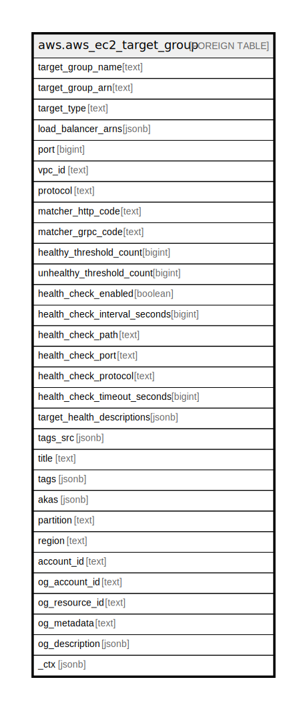

# aws.aws_ec2_target_group

## Description

AWS EC2 Target Group

## Columns

| Name | Type | Default | Nullable | Children | Parents | Comment |
| ---- | ---- | ------- | -------- | -------- | ------- | ------- |
| target_group_name | text |  | true |  |  | The name of the target group. |
| target_group_arn | text |  | true |  |  | The Amazon Resource Name (ARN) of the target group. |
| target_type | text |  | true |  |  | The type of target that is specified when registering targets with this target group. The possible values are instance (register targets by instance ID), ip (register targets by IP address), or lambda (register a single Lambda function as a target). |
| load_balancer_arns | jsonb |  | true |  |  | The Amazon Resource Names (ARN) of the load balancers that route traffic to this target group. |
| port | bigint |  | true |  |  | The port on which the targets are listening. Not used if the target is a Lambda function. |
| vpc_id | text |  | true |  |  | The ID of the VPC for the target. |
| protocol | text |  | true |  |  | The protocol to use for routing traffic to the target. |
| matcher_http_code | text |  | true |  |  | The HTTP codes to use when checking for a successful response from a target. |
| matcher_grpc_code | text |  | true |  |  | The gRPC codes to use when checking for a successful response from a target. |
| healthy_threshold_count | bigint |  | true |  |  | The number of consecutive health checks successes required before considering an unhealthy target healthy. |
| unhealthy_threshold_count | bigint |  | true |  |  | The number of consecutive health checks successes required before considering an unhealthy target healthy. |
| health_check_enabled | boolean |  | true |  |  | Indicates whether health checks are enabled. |
| health_check_interval_seconds | bigint |  | true |  |  | The approximate amount of time, in seconds, between health checks of an individual target. |
| health_check_path | text |  | true |  |  | The destination for health checks on the target. |
| health_check_port | text |  | true |  |  | The port to use to connect with the target. |
| health_check_protocol | text |  | true |  |  | The protocol to use to connect with the target. The GENEVE, TLS, UDP, and TCP_UDP protocols are not supported for health checks. |
| health_check_timeout_seconds | bigint |  | true |  |  | The amount of time, in seconds, during which no response means a failed health check. |
| target_health_descriptions | jsonb |  | true |  |  | Contains information about the health of the target. |
| tags_src | jsonb |  | true |  |  | A list of tags associated with target group. |
| title | text |  | true |  |  | Title of the resource. |
| tags | jsonb |  | true |  |  | A map of tags for the resource. |
| akas | jsonb |  | true |  |  | Array of globally unique identifier strings (also known as) for the resource. |
| partition | text |  | true |  |  | The AWS partition in which the resource is located (aws, aws-cn, or aws-us-gov). |
| region | text |  | true |  |  | The AWS Region in which the resource is located. |
| account_id | text |  | true |  |  | The AWS Account ID in which the resource is located. |
| og_account_id | text |  | true |  |  | The Platform Account ID in which the resource is located. |
| og_resource_id | text |  | true |  |  | The unique ID of the resource in opengovernance. |
| og_metadata | text |  | true |  |  | Platform Metadata of the AWS resource. |
| og_description | jsonb |  | true |  |  | The full model description of the resource |
| _ctx | jsonb |  | true |  |  | Steampipe context in JSON form, e.g. connection_name. |

## Relations

---

> Generated by [tbls](https://github.com/k1LoW/tbls)
