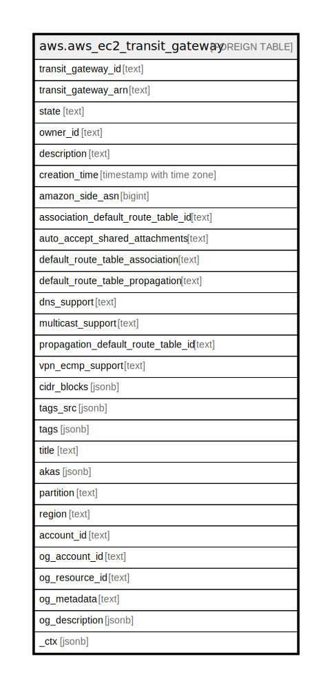

# aws.aws_ec2_transit_gateway

## Description

AWS EC2 Transit Gateway

## Columns

| Name | Type | Default | Nullable | Children | Parents | Comment |
| ---- | ---- | ------- | -------- | -------- | ------- | ------- |
| transit_gateway_id | text |  | true |  |  | The ID of the transit gateway. |
| transit_gateway_arn | text |  | true |  |  | The Amazon Resource Name (ARN) of the transit gateway. |
| state | text |  | true |  |  | The state of the transit gateway. |
| owner_id | text |  | true |  |  | The ID of the AWS account ID that owns the transit gateway. |
| description | text |  | true |  |  | The description of the transit gateway. |
| creation_time | timestamp with time zone |  | true |  |  | The date and time when transit gateway was created. |
| amazon_side_asn | bigint |  | true |  |  | A private Autonomous System Number (ASN) for the Amazon side of a BGP session. The range is 64512 to 65534 for 16-bit ASNs and 4200000000 to 4294967294 for 32-bit ASNs. |
| association_default_route_table_id | text |  | true |  |  | The ID of the default association route table. |
| auto_accept_shared_attachments | text |  | true |  |  | Indicates whether attachment requests are automatically accepted. |
| default_route_table_association | text |  | true |  |  | Indicates whether resource attachments are automatically associated with the default association route table. |
| default_route_table_propagation | text |  | true |  |  | Indicates whether resource attachments are automatically associated with the default association route table. |
| dns_support | text |  | true |  |  | Indicates whether DNS support is enabled. |
| multicast_support | text |  | true |  |  | Indicates whether multicast is enabled on the transit gateway. |
| propagation_default_route_table_id | text |  | true |  |  | The ID of the default propagation route table. |
| vpn_ecmp_support | text |  | true |  |  | Indicates whether Equal Cost Multipath Protocol support is enabled. |
| cidr_blocks | jsonb |  | true |  |  | A list of transit gateway CIDR blocks. |
| tags_src | jsonb |  | true |  |  | A list of tags that are assigned to the transit gateway. |
| tags | jsonb |  | true |  |  | A map of tags for the resource. |
| title | text |  | true |  |  | Title of the resource. |
| akas | jsonb |  | true |  |  | Array of globally unique identifier strings (also known as) for the resource. |
| partition | text |  | true |  |  | The AWS partition in which the resource is located (aws, aws-cn, or aws-us-gov). |
| region | text |  | true |  |  | The AWS Region in which the resource is located. |
| account_id | text |  | true |  |  | The AWS Account ID in which the resource is located. |
| og_account_id | text |  | true |  |  | The Platform Account ID in which the resource is located. |
| og_resource_id | text |  | true |  |  | The unique ID of the resource in opengovernance. |
| og_metadata | text |  | true |  |  | Platform Metadata of the AWS resource. |
| og_description | jsonb |  | true |  |  | The full model description of the resource |
| _ctx | jsonb |  | true |  |  | Steampipe context in JSON form, e.g. connection_name. |

## Relations

---

> Generated by [tbls](https://github.com/k1LoW/tbls)
