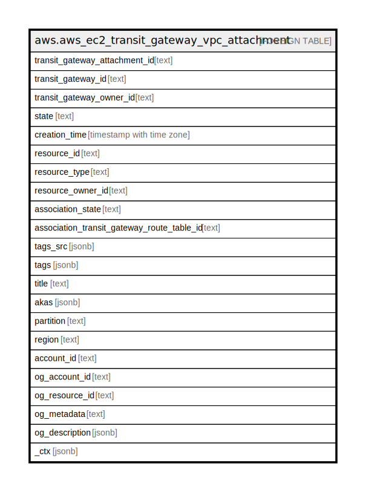

# aws.aws_ec2_transit_gateway_vpc_attachment

## Description

## Columns

| Name | Type | Default | Nullable | Children | Parents | Comment |
| ---- | ---- | ------- | -------- | -------- | ------- | ------- |
| transit_gateway_attachment_id | text |  | true |  |  | The ID of the transit gateway attachment. |
| transit_gateway_id | text |  | true |  |  | The ID of the transit gateway. |
| transit_gateway_owner_id | text |  | true |  |  | The ID of the AWS account that owns the transit gateway. |
| state | text |  | true |  |  | The attachment state of the transit gateway attachment. |
| creation_time | timestamp with time zone |  | true |  |  | The creation time of the transit gateway attachment. |
| resource_id | text |  | true |  |  | The ID of the resource. |
| resource_type | text |  | true |  |  | The resource type of the transit gateway attachment. |
| resource_owner_id | text |  | true |  |  | The ID of the AWS account that owns the resource. |
| association_state | text |  | true |  |  | The state of the association. |
| association_transit_gateway_route_table_id | text |  | true |  |  | The ID of the route table for the transit gateway. |
| tags_src | jsonb |  | true |  |  | A list of tags assigned. |
| tags | jsonb |  | true |  |  | A map of tags for the resource. |
| title | text |  | true |  |  | Title of the resource. |
| akas | jsonb |  | true |  |  | Array of globally unique identifier strings (also known as) for the resource. |
| partition | text |  | true |  |  | The AWS partition in which the resource is located (aws, aws-cn, or aws-us-gov). |
| region | text |  | true |  |  | The AWS Region in which the resource is located. |
| account_id | text |  | true |  |  | The AWS Account ID in which the resource is located. |
| og_account_id | text |  | true |  |  | The Platform Account ID in which the resource is located. |
| og_resource_id | text |  | true |  |  | The unique ID of the resource in opengovernance. |
| og_metadata | text |  | true |  |  | Platform Metadata of the AWS resource. |
| og_description | jsonb |  | true |  |  | The full model description of the resource |
| _ctx | jsonb |  | true |  |  | Steampipe context in JSON form, e.g. connection_name. |

## Relations

---

> Generated by [tbls](https://github.com/k1LoW/tbls)
