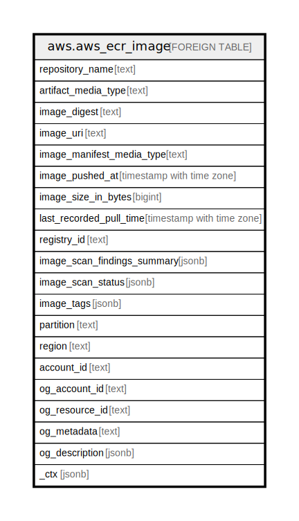

# aws.aws_ecr_image

## Description

AWS ECR Image

## Columns

| Name | Type | Default | Nullable | Children | Parents | Comment |
| ---- | ---- | ------- | -------- | -------- | ------- | ------- |
| repository_name | text |  | true |  |  | The name of the repository. |
| artifact_media_type | text |  | true |  |  | The artifact media type of the image. |
| image_digest | text |  | true |  |  | The sha256 digest of the image manifest. |
| image_uri | text |  | true |  |  | The URI for the image. |
| image_manifest_media_type | text |  | true |  |  | The media type of the image manifest. |
| image_pushed_at | timestamp with time zone |  | true |  |  | The date and time, expressed in standard JavaScript date format, at which the current image was pushed to the repository. |
| image_size_in_bytes | bigint |  | true |  |  | The size, in bytes, of the image in the repository. |
| last_recorded_pull_time | timestamp with time zone |  | true |  |  | The date and time, expressed in standard JavaScript date format, when Amazon ECR recorded the last image pull. |
| registry_id | text |  | true |  |  | The Amazon Web Services account ID associated with the registry to which this image belongs. |
| image_scan_findings_summary | jsonb |  | true |  |  | A summary of the last completed image scan. |
| image_scan_status | jsonb |  | true |  |  | The current state of the scan. |
| image_tags | jsonb |  | true |  |  | The list of tags associated with this image. |
| partition | text |  | true |  |  | The AWS partition in which the resource is located (aws, aws-cn, or aws-us-gov). |
| region | text |  | true |  |  | The AWS Region in which the resource is located. |
| account_id | text |  | true |  |  | The AWS Account ID in which the resource is located. |
| og_account_id | text |  | true |  |  | The Platform Account ID in which the resource is located. |
| og_resource_id | text |  | true |  |  | The unique ID of the resource in opengovernance. |
| og_metadata | text |  | true |  |  | Platform Metadata of the AWS resource. |
| og_description | jsonb |  | true |  |  | The full model description of the resource |
| _ctx | jsonb |  | true |  |  | Steampipe context in JSON form, e.g. connection_name. |

## Relations

---

> Generated by [tbls](https://github.com/k1LoW/tbls)
