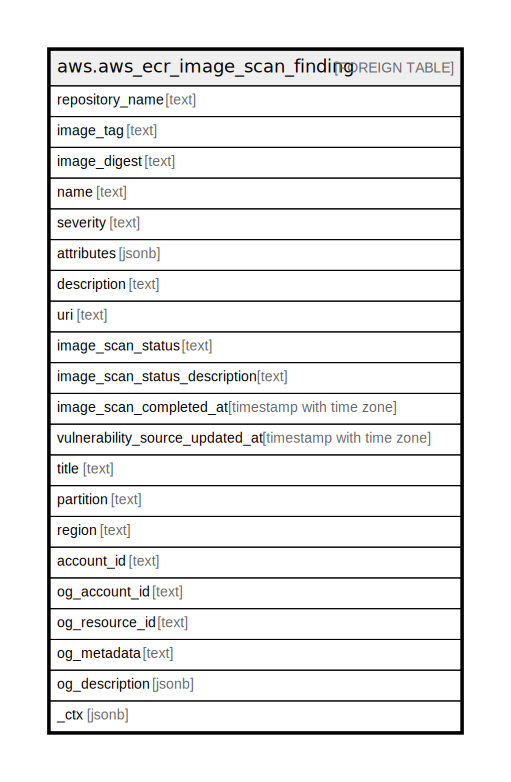

# aws.aws_ecr_image_scan_finding

## Description

AWS ECR Image Scan Finding

## Columns

| Name | Type | Default | Nullable | Children | Parents | Comment |
| ---- | ---- | ------- | -------- | -------- | ------- | ------- |
| repository_name | text |  | true |  |  | The name of the repository. |
| image_tag | text |  | true |  |  | The image tag |
| image_digest | text |  | true |  |  | The image digest |
| name | text |  | true |  |  | The name associated with the finding, usually a CVE number. |
| severity | text |  | true |  |  | The finding severity. |
| attributes | jsonb |  | true |  |  | A collection of attributes of the host from which the finding is generated. |
| description | text |  | true |  |  | The description of the finding. |
| uri | text |  | true |  |  | A link containing additional details about the security vulnerability. |
| image_scan_status | text |  | true |  |  | The current state of the scan |
| image_scan_status_description | text |  | true |  |  | The description of the image scan status. |
| image_scan_completed_at | timestamp with time zone |  | true |  |  | The date and time, in JavaScript date format, when the repository was created. |
| vulnerability_source_updated_at | timestamp with time zone |  | true |  |  | The date and time, in JavaScript date format, when the repository was created. |
| title | text |  | true |  |  | Title of the resource. |
| partition | text |  | true |  |  | The AWS partition in which the resource is located (aws, aws-cn, or aws-us-gov). |
| region | text |  | true |  |  | The AWS Region in which the resource is located. |
| account_id | text |  | true |  |  | The AWS Account ID in which the resource is located. |
| og_account_id | text |  | true |  |  | The Platform Account ID in which the resource is located. |
| og_resource_id | text |  | true |  |  | The unique ID of the resource in opengovernance. |
| og_metadata | text |  | true |  |  | Platform Metadata of the AWS resource. |
| og_description | jsonb |  | true |  |  | The full model description of the resource |
| _ctx | jsonb |  | true |  |  | Steampipe context in JSON form, e.g. connection_name. |

## Relations

---

> Generated by [tbls](https://github.com/k1LoW/tbls)
