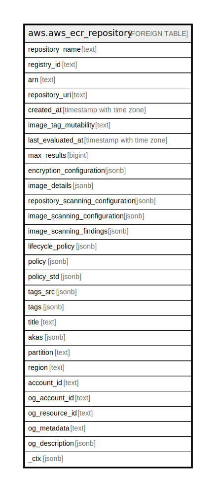

# aws.aws_ecr_repository

## Description

AWS ECR Repository

## Columns

| Name | Type | Default | Nullable | Children | Parents | Comment |
| ---- | ---- | ------- | -------- | -------- | ------- | ------- |
| repository_name | text |  | true |  |  | The name of the repository. |
| registry_id | text |  | true |  |  | The AWS account ID associated with the registry that contains the repositories to be described. |
| arn | text |  | true |  |  | The Amazon Resource Name (ARN) that identifies the repository. |
| repository_uri | text |  | true |  |  | The URI for the repository. |
| created_at | timestamp with time zone |  | true |  |  | The date and time, in JavaScript date format, when the repository was created. |
| image_tag_mutability | text |  | true |  |  | The tag mutability setting for the repository. |
| last_evaluated_at | timestamp with time zone |  | true |  |  | The time stamp of the last time that the lifecycle policy was run. |
| max_results | bigint |  | true |  |  | The maximum number of repository results returned by DescribeRepositories. |
| encryption_configuration | jsonb |  | true |  |  | The encryption configuration for the repository. |
| image_details | jsonb |  | true |  |  | A list of ImageDetail objects that contain data about the image. |
| repository_scanning_configuration | jsonb |  | true |  |  | Gets the scanning configuration for one or more repositories. |
| image_scanning_configuration | jsonb |  | true |  |  | The image scanning configuration for a repository. |
| image_scanning_findings | jsonb |  | true |  |  | Scan findings for an image. |
| lifecycle_policy | jsonb |  | true |  |  | The JSON lifecycle policy text. |
| policy | jsonb |  | true |  |  | The JSON repository policy text associated with the repository. |
| policy_std | jsonb |  | true |  |  | Contains the policy in a canonical form for easier searching. |
| tags_src | jsonb |  | true |  |  | A list of tags assigned to the Repository. |
| tags | jsonb |  | true |  |  | A map of tags for the resource. |
| title | text |  | true |  |  | Title of the resource. |
| akas | jsonb |  | true |  |  | Array of globally unique identifier strings (also known as) for the resource. |
| partition | text |  | true |  |  | The AWS partition in which the resource is located (aws, aws-cn, or aws-us-gov). |
| region | text |  | true |  |  | The AWS Region in which the resource is located. |
| account_id | text |  | true |  |  | The AWS Account ID in which the resource is located. |
| og_account_id | text |  | true |  |  | The Platform Account ID in which the resource is located. |
| og_resource_id | text |  | true |  |  | The unique ID of the resource in opengovernance. |
| og_metadata | text |  | true |  |  | Platform Metadata of the AWS resource. |
| og_description | jsonb |  | true |  |  | The full model description of the resource |
| _ctx | jsonb |  | true |  |  | Steampipe context in JSON form, e.g. connection_name. |

## Relations

---

> Generated by [tbls](https://github.com/k1LoW/tbls)
