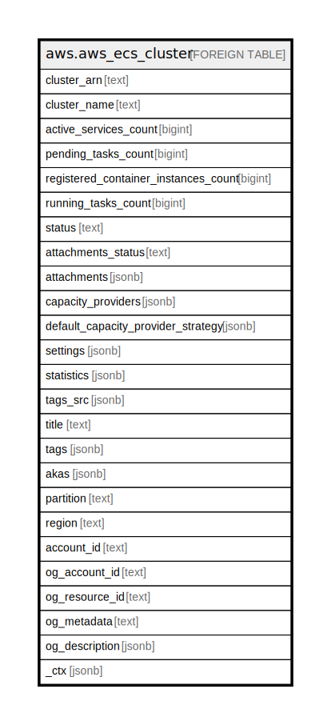

# aws.aws_ecs_cluster

## Description

AWS ECS Cluster

## Columns

| Name | Type | Default | Nullable | Children | Parents | Comment |
| ---- | ---- | ------- | -------- | -------- | ------- | ------- |
| cluster_arn | text |  | true |  |  | The Amazon Resource Name (ARN) that identifies the cluster. |
| cluster_name | text |  | true |  |  | A user-generated string that you use to identify your cluster. |
| active_services_count | bigint |  | true |  |  | The number of services that are running on the cluster in an ACTIVE state. |
| pending_tasks_count | bigint |  | true |  |  | The number of tasks in the cluster that are in the PENDING state. |
| registered_container_instances_count | bigint |  | true |  |  | The number of container instances registered into the cluster. This includes container instances in both ACTIVE and DRAINING status. |
| running_tasks_count | bigint |  | true |  |  | The number of tasks in the cluster that are in the RUNNING state. |
| status | text |  | true |  |  | The status of the cluster. |
| attachments_status | text |  | true |  |  | The status of the capacity providers associated with the cluster. |
| attachments | jsonb |  | true |  |  | The resources attached to a cluster. When using a capacity provider with a cluster, the Auto Scaling plan that is created will be returned as a cluster attachment. |
| capacity_providers | jsonb |  | true |  |  | The capacity providers associated with the cluster. |
| default_capacity_provider_strategy | jsonb |  | true |  |  | The default capacity provider strategy for the cluster. |
| settings | jsonb |  | true |  |  | The settings for the cluster. This parameter indicates whether CloudWatch Container Insights is enabled or disabled for a cluster. |
| statistics | jsonb |  | true |  |  | Additional information about your clusters that are separated by launch type. |
| tags_src | jsonb |  | true |  |  | A list of tags attached to the cluster. |
| title | text |  | true |  |  | Title of the resource. |
| tags | jsonb |  | true |  |  | A map of tags for the resource. |
| akas | jsonb |  | true |  |  | Array of globally unique identifier strings (also known as) for the resource. |
| partition | text |  | true |  |  | The AWS partition in which the resource is located (aws, aws-cn, or aws-us-gov). |
| region | text |  | true |  |  | The AWS Region in which the resource is located. |
| account_id | text |  | true |  |  | The AWS Account ID in which the resource is located. |
| og_account_id | text |  | true |  |  | The Platform Account ID in which the resource is located. |
| og_resource_id | text |  | true |  |  | The unique ID of the resource in opengovernance. |
| og_metadata | text |  | true |  |  | Platform Metadata of the AWS resource. |
| og_description | jsonb |  | true |  |  | The full model description of the resource |
| _ctx | jsonb |  | true |  |  | Steampipe context in JSON form, e.g. connection_name. |

## Relations

---

> Generated by [tbls](https://github.com/k1LoW/tbls)
