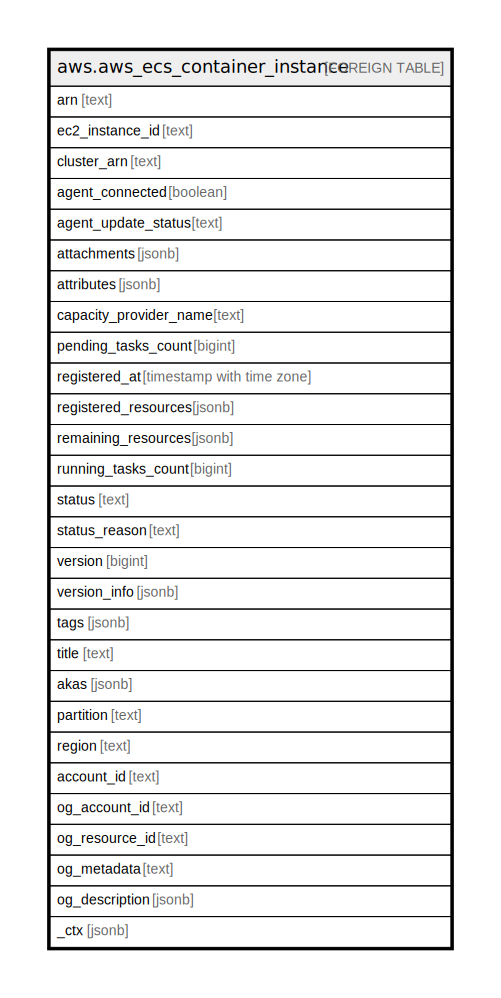

# aws.aws_ecs_container_instance

## Description

AWS ECS Container Instance

## Columns

| Name | Type | Default | Nullable | Children | Parents | Comment |
| ---- | ---- | ------- | -------- | -------- | ------- | ------- |
| arn | text |  | true |  |  | The namespace Amazon Resource Name (ARN) of the container instance. |
| ec2_instance_id | text |  | true |  |  | The EC2 instance ID of the container instance. |
| cluster_arn | text |  | true |  |  | The ARN of the cluster. |
| agent_connected | boolean |  | true |  |  | True if the agent is connected to Amazon ECS. |
| agent_update_status | text |  | true |  |  | The status of the most recent agent update. |
| attachments | jsonb |  | true |  |  | The resources attached to a container instance, such as elastic network interfaces. |
| attributes | jsonb |  | true |  |  | The attributes set for the container instance. |
| capacity_provider_name | text |  | true |  |  | The capacity provider associated with the container instance. |
| pending_tasks_count | bigint |  | true |  |  | The number of tasks on the container instance that are in the PENDING status. |
| registered_at | timestamp with time zone |  | true |  |  | The Unix timestamp for when the container instance was registered. |
| registered_resources | jsonb |  | true |  |  | CPU and memory that can be allocated on this container instance to tasks. |
| remaining_resources | jsonb |  | true |  |  | CPU and memory that is available for new tasks. |
| running_tasks_count | bigint |  | true |  |  | CPU and memory that is available for new tasks. |
| status | text |  | true |  |  | The status of the container instance. |
| status_reason | text |  | true |  |  | The reason that the container instance reached its current status. |
| version | bigint |  | true |  |  | The reason that the container instance reached its current status. |
| version_info | jsonb |  | true |  |  | Version information for the Amazon ECS container agent and Docker daemon running on the container instance. |
| tags | jsonb |  | true |  |  | A map of tags for the resource. |
| title | text |  | true |  |  | Title of the resource. |
| akas | jsonb |  | true |  |  | Array of globally unique identifier strings (also known as) for the resource. |
| partition | text |  | true |  |  | The AWS partition in which the resource is located (aws, aws-cn, or aws-us-gov). |
| region | text |  | true |  |  | The AWS Region in which the resource is located. |
| account_id | text |  | true |  |  | The AWS Account ID in which the resource is located. |
| og_account_id | text |  | true |  |  | The Platform Account ID in which the resource is located. |
| og_resource_id | text |  | true |  |  | The unique ID of the resource in opengovernance. |
| og_metadata | text |  | true |  |  | Platform Metadata of the AWS resource. |
| og_description | jsonb |  | true |  |  | The full model description of the resource |
| _ctx | jsonb |  | true |  |  | Steampipe context in JSON form, e.g. connection_name. |

## Relations

---

> Generated by [tbls](https://github.com/k1LoW/tbls)
