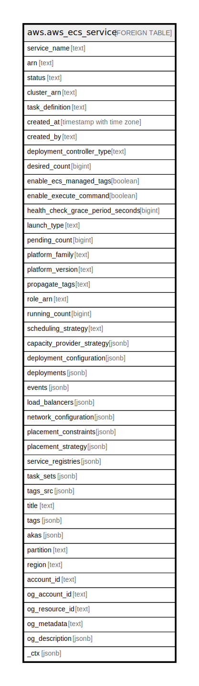

# aws.aws_ecs_service

## Description

AWS ECS Service

## Columns

| Name | Type | Default | Nullable | Children | Parents | Comment |
| ---- | ---- | ------- | -------- | -------- | ------- | ------- |
| service_name | text |  | true |  |  | The name of the service. |
| arn | text |  | true |  |  | The Amazon Resource Name (ARN) specifying the service. |
| status | text |  | true |  |  | The status of the service. Valid values are: ACTIVE, DRAINING, or INACTIVE. |
| cluster_arn | text |  | true |  |  | The Amazon Resource Name (ARN) of the cluster that hosts the service. |
| task_definition | text |  | true |  |  | The task definition to use for tasks in the service. |
| created_at | timestamp with time zone |  | true |  |  | The date and time when the service was created. |
| created_by | text |  | true |  |  | The principal that created the service. |
| deployment_controller_type | text |  | true |  |  | The deployment controller type to use. Possible values are: ECS, CODE_DEPLOY, and EXTERNAL. |
| desired_count | bigint |  | true |  |  | The desired number of instantiations of the task definition to keep running on the service. |
| enable_ecs_managed_tags | boolean |  | true |  |  | Specifies whether to enable Amazon ECS managed tags for the tasks in the service. |
| enable_execute_command | boolean |  | true |  |  | Indicates whether or not the execute command functionality is enabled for the service. |
| health_check_grace_period_seconds | bigint |  | true |  |  | The period of time, in seconds, that the Amazon ECS service scheduler ignores unhealthy Elastic Load Balancing target health checks after a task has first started. |
| launch_type | text |  | true |  |  | The launch type on which your service is running. If no value is specified, it will default to EC2. |
| pending_count | bigint |  | true |  |  | The number of tasks in the cluster that are in the PENDING state. |
| platform_family | text |  | true |  |  | The operating system that your tasks in the service run on. |
| platform_version | text |  | true |  |  | The platform version on which to run your service. |
| propagate_tags | text |  | true |  |  | Specifies whether to propagate the tags from the task definition or the service to the task. If no value is specified, the tags are not propagated. |
| role_arn | text |  | true |  |  | The ARN of the IAM role associated with the service that allows the Amazon ECS container agent to register container instances with an Elastic Load Balancing load balancer. |
| running_count | bigint |  | true |  |  | The number of tasks in the cluster that are in the RUNNING state. |
| scheduling_strategy | text |  | true |  |  | The scheduling strategy to use for the service. |
| capacity_provider_strategy | jsonb |  | true |  |  | The capacity provider strategy associated with the service. |
| deployment_configuration | jsonb |  | true |  |  | Optional deployment parameters that control how many tasks run during the deployment and the ordering of stopping and starting tasks. |
| deployments | jsonb |  | true |  |  | The current state of deployments for the service. |
| events | jsonb |  | true |  |  | The event stream for your service. A maximum of 100 of the latest events are displayed. |
| load_balancers | jsonb |  | true |  |  | A list of Elastic Load Balancing load balancer objects, containing the load balancer name, the container name (as it appears in a container definition), and the container port to access from the load balancer. |
| network_configuration | jsonb |  | true |  |  | The VPC subnet and security group configuration for tasks that receive their own elastic network interface by using the awsvpc networking mode. |
| placement_constraints | jsonb |  | true |  |  | The placement constraints for the tasks in the service. |
| placement_strategy | jsonb |  | true |  |  | The placement strategy that determines how tasks for the service are placed. |
| service_registries | jsonb |  | true |  |  | The details of the service discovery registries to assign to this service. |
| task_sets | jsonb |  | true |  |  | Information about a set of Amazon ECS tasks in either an AWS CodeDeploy or an EXTERNAL deployment. |
| tags_src | jsonb |  | true |  |  | The metadata that you apply to the service to help you categorize and organize them. |
| title | text |  | true |  |  | Title of the resource. |
| tags | jsonb |  | true |  |  | A map of tags for the resource. |
| akas | jsonb |  | true |  |  | Array of globally unique identifier strings (also known as) for the resource. |
| partition | text |  | true |  |  | The AWS partition in which the resource is located (aws, aws-cn, or aws-us-gov). |
| region | text |  | true |  |  | The AWS Region in which the resource is located. |
| account_id | text |  | true |  |  | The AWS Account ID in which the resource is located. |
| og_account_id | text |  | true |  |  | The Platform Account ID in which the resource is located. |
| og_resource_id | text |  | true |  |  | The unique ID of the resource in opengovernance. |
| og_metadata | text |  | true |  |  | Platform Metadata of the AWS resource. |
| og_description | jsonb |  | true |  |  | The full model description of the resource |
| _ctx | jsonb |  | true |  |  | Steampipe context in JSON form, e.g. connection_name. |

## Relations

---

> Generated by [tbls](https://github.com/k1LoW/tbls)
