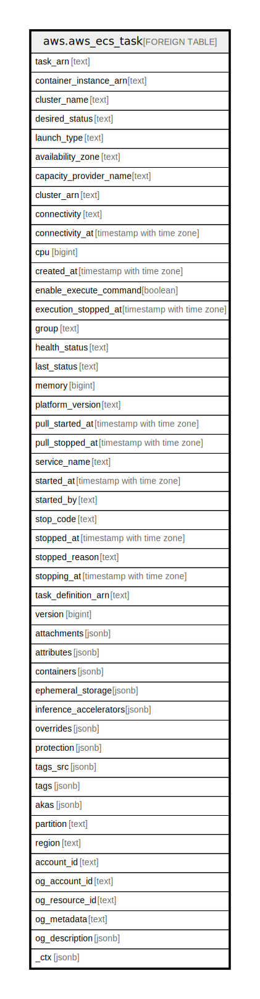

# aws.aws_ecs_task

## Description

AWS ECS Task

## Columns

| Name | Type | Default | Nullable | Children | Parents | Comment |
| ---- | ---- | ------- | -------- | -------- | ------- | ------- |
| task_arn | text |  | true |  |  | The Amazon Resource Name (ARN) of the task. |
| container_instance_arn | text |  | true |  |  | The ARN of the container instances that host the task. |
| cluster_name | text |  | true |  |  | A user-generated string that you use to identify your cluster. |
| desired_status | text |  | true |  |  | The desired status of the task. |
| launch_type | text |  | true |  |  | The infrastructure on which your task is running. |
| availability_zone | text |  | true |  |  | The availability zone of the task. |
| capacity_provider_name | text |  | true |  |  | The capacity provider associated with the task. |
| cluster_arn | text |  | true |  |  | The ARN of the cluster that hosts the task. |
| connectivity | text |  | true |  |  | The connectivity status of a task. |
| connectivity_at | timestamp with time zone |  | true |  |  | The Unix timestamp for when the task last went into CONNECTED status. |
| cpu | bigint |  | true |  |  | The number of CPU units used by the task as expressed in a task definition. |
| created_at | timestamp with time zone |  | true |  |  | The Unix timestamp for when the task was created. |
| enable_execute_command | boolean |  | true |  |  | Whether or not execute command functionality is enabled for this task. If true, this enables execute command functionality on all containers in the task. |
| execution_stopped_at | timestamp with time zone |  | true |  |  | The Unix timestamp for when the task execution stopped. |
| group | text |  | true |  |  | The name of the task group associated with the task. |
| health_status | text |  | true |  |  | The health status for the task, which is determined by the health of the essential containers in the task. If all essential containers in the task are reporting as HEALTHY, then the task status also reports as HEALTHY. |
| last_status | text |  | true |  |  | The last known status of the task. |
| memory | bigint |  | true |  |  | The amount of memory (in MiB) used by the task as expressed in a task definition. |
| platform_version | text |  | true |  |  | The platform version on which your task is running. |
| pull_started_at | timestamp with time zone |  | true |  |  | The Unix timestamp for when the container image pull began. |
| pull_stopped_at | timestamp with time zone |  | true |  |  | The Unix timestamp for when the container image pull completed. |
| service_name | text |  | true |  |  | The name of the service. |
| started_at | timestamp with time zone |  | true |  |  | The Unix timestamp for when the task started. |
| started_by | text |  | true |  |  | The tag specified when a task is started. |
| stop_code | text |  | true |  |  | The stop code indicating why a task was stopped. |
| stopped_at | timestamp with time zone |  | true |  |  | The Unix timestamp for when the task was stopped. |
| stopped_reason | text |  | true |  |  | The reason that the task was stopped. |
| stopping_at | timestamp with time zone |  | true |  |  | The Unix timestamp for when the task stops. |
| task_definition_arn | text |  | true |  |  | The ARN of the task definition that creates the task. |
| version | bigint |  | true |  |  | The version counter for the task. |
| attachments | jsonb |  | true |  |  | The Elastic Network Adapter associated with the task if the task uses the awsvpc network mode. |
| attributes | jsonb |  | true |  |  | The attributes of the task. |
| containers | jsonb |  | true |  |  | The containers associated with the task. |
| ephemeral_storage | jsonb |  | true |  |  | The ephemeral storage settings for the task. |
| inference_accelerators | jsonb |  | true |  |  | The Elastic Inference accelerator associated with the task. |
| overrides | jsonb |  | true |  |  | One or more container overrides. |
| protection | jsonb |  | true |  |  | Protection status of task in an Amazon ECS service. |
| tags_src | jsonb |  | true |  |  | A list of tags associated with task. |
| tags | jsonb |  | true |  |  | A map of tags for the resource. |
| akas | jsonb |  | true |  |  | Array of globally unique identifier strings (also known as) for the resource. |
| partition | text |  | true |  |  | The AWS partition in which the resource is located (aws, aws-cn, or aws-us-gov). |
| region | text |  | true |  |  | The AWS Region in which the resource is located. |
| account_id | text |  | true |  |  | The AWS Account ID in which the resource is located. |
| og_account_id | text |  | true |  |  | The Platform Account ID in which the resource is located. |
| og_resource_id | text |  | true |  |  | The unique ID of the resource in opengovernance. |
| og_metadata | text |  | true |  |  | Platform Metadata of the AWS resource. |
| og_description | jsonb |  | true |  |  | The full model description of the resource |
| _ctx | jsonb |  | true |  |  | Steampipe context in JSON form, e.g. connection_name. |

## Relations

---

> Generated by [tbls](https://github.com/k1LoW/tbls)
