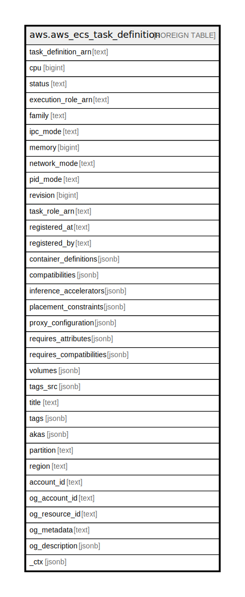

# aws.aws_ecs_task_definition

## Description

AWS ECS Task Definition

## Columns

| Name | Type | Default | Nullable | Children | Parents | Comment |
| ---- | ---- | ------- | -------- | -------- | ------- | ------- |
| task_definition_arn | text |  | true |  |  | The Amazon Resource Name (ARN) that identifies the task definition. |
| cpu | bigint |  | true |  |  | The number of cpu units used by the task. |
| status | text |  | true |  |  | The status of the task definition. |
| execution_role_arn | text |  | true |  |  | The Amazon Resource Name (ARN) of the task execution role that grants the Amazon ECS container agent permission to make AWS API calls on your behalf. |
| family | text |  | true |  |  | The name of a family that this task definition is registered to. |
| ipc_mode | text |  | true |  |  | The IPC resource namespace to use for the containers in the task. |
| memory | bigint |  | true |  |  | The amount (in MiB) of memory used by the task. |
| network_mode | text |  | true |  |  | The Docker networking mode to use for the containers in the task. |
| pid_mode | text |  | true |  |  | The process namespace to use for the containers in the task. |
| revision | bigint |  | true |  |  | The revision of the task in a particular family. |
| task_role_arn | text |  | true |  |  | The short name or full Amazon Resource Name (ARN) of the AWS Identity and Access Management (IAM) role that grants containers in the task permission to call AWS APIs on your behalf. |
| registered_at | text |  | true |  |  | The Unix timestamp for when the task definition was registered. |
| registered_by | text |  | true |  |  | The principal that registered the task definition. |
| container_definitions | jsonb |  | true |  |  | A list of container definitions in JSON format that describe the different containers that make up your task. |
| compatibilities | jsonb |  | true |  |  | The launch type to use with your task. |
| inference_accelerators | jsonb |  | true |  |  | The Elastic Inference accelerator associated with the task. |
| placement_constraints | jsonb |  | true |  |  | An array of placement constraint objects to use for tasks. |
| proxy_configuration | jsonb |  | true |  |  | The configuration details for the App Mesh proxy. |
| requires_attributes | jsonb |  | true |  |  | The container instance attributes required by your task. |
| requires_compatibilities | jsonb |  | true |  |  | The launch type the task requires. If no value is specified, it will default to EC2. Valid values include EC2 and FARGATE. |
| volumes | jsonb |  | true |  |  | The list of volume definitions for the task. |
| tags_src | jsonb |  | true |  |  | A list of tags associated with task. |
| title | text |  | true |  |  | Title of the resource. |
| tags | jsonb |  | true |  |  | A map of tags for the resource. |
| akas | jsonb |  | true |  |  | Array of globally unique identifier strings (also known as) for the resource. |
| partition | text |  | true |  |  | The AWS partition in which the resource is located (aws, aws-cn, or aws-us-gov). |
| region | text |  | true |  |  | The AWS Region in which the resource is located. |
| account_id | text |  | true |  |  | The AWS Account ID in which the resource is located. |
| og_account_id | text |  | true |  |  | The Platform Account ID in which the resource is located. |
| og_resource_id | text |  | true |  |  | The unique ID of the resource in opengovernance. |
| og_metadata | text |  | true |  |  | Platform Metadata of the AWS resource. |
| og_description | jsonb |  | true |  |  | The full model description of the resource |
| _ctx | jsonb |  | true |  |  | Steampipe context in JSON form, e.g. connection_name. |

## Relations

---

> Generated by [tbls](https://github.com/k1LoW/tbls)
