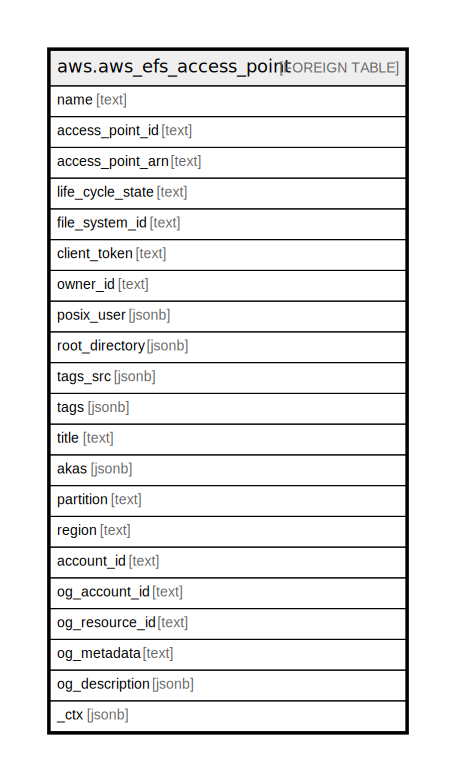

# aws.aws_efs_access_point

## Description

AWS EFS Access Point

## Columns

| Name | Type | Default | Nullable | Children | Parents | Comment |
| ---- | ---- | ------- | -------- | -------- | ------- | ------- |
| name | text |  | true |  |  | The name of the access point. This is the value of the Name tag. |
| access_point_id | text |  | true |  |  | The ID of the access point, assigned by Amazon EFS. |
| access_point_arn | text |  | true |  |  | The unique Amazon Resource Name (ARN) associated with the access point. |
| life_cycle_state | text |  | true |  |  | Identifies the lifecycle phase of the access point. |
| file_system_id | text |  | true |  |  | The ID of the EFS file system that the access point applies to. |
| client_token | text |  | true |  |  | The opaque string specified in the request to ensure idempotent creation. |
| owner_id | text |  | true |  |  | Identified the AWS account that owns the access point resource. |
| posix_user | jsonb |  | true |  |  | The full POSIX identity, including the user ID, group ID, and secondary group IDs on the access point that is used for all file operations by NFS clients using the access point. |
| root_directory | jsonb |  | true |  |  | The directory on the Amazon EFS file system that the access point exposes as the root directory to NFS clients using the access point. |
| tags_src | jsonb |  | true |  |  | The tags associated with the access point, presented as an array of Tag objects. |
| tags | jsonb |  | true |  |  | A map of tags for the resource. |
| title | text |  | true |  |  | Title of the resource. |
| akas | jsonb |  | true |  |  | Array of globally unique identifier strings (also known as) for the resource. |
| partition | text |  | true |  |  | The AWS partition in which the resource is located (aws, aws-cn, or aws-us-gov). |
| region | text |  | true |  |  | The AWS Region in which the resource is located. |
| account_id | text |  | true |  |  | The AWS Account ID in which the resource is located. |
| og_account_id | text |  | true |  |  | The Platform Account ID in which the resource is located. |
| og_resource_id | text |  | true |  |  | The unique ID of the resource in opengovernance. |
| og_metadata | text |  | true |  |  | Platform Metadata of the AWS resource. |
| og_description | jsonb |  | true |  |  | The full model description of the resource |
| _ctx | jsonb |  | true |  |  | Steampipe context in JSON form, e.g. connection_name. |

## Relations

---

> Generated by [tbls](https://github.com/k1LoW/tbls)
