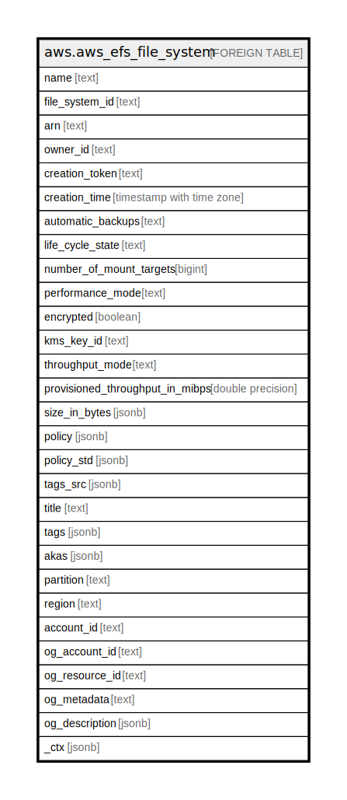

# aws.aws_efs_file_system

## Description

AWS Elastic File System

## Columns

| Name | Type | Default | Nullable | Children | Parents | Comment |
| ---- | ---- | ------- | -------- | -------- | ------- | ------- |
| name | text |  | true |  |  | Name of the file system provided by the user. |
| file_system_id | text |  | true |  |  | The ID of the file system, assigned by Amazon EFS. |
| arn | text |  | true |  |  | The Amazon Resource Name (ARN) for the EFS file system. |
| owner_id | text |  | true |  |  | The AWS account that created the file system. |
| creation_token | text |  | true |  |  | The opaque string specified in the request. |
| creation_time | timestamp with time zone |  | true |  |  | The time that the file system was created. |
| automatic_backups | text |  | true |  |  | Automatic backups use a default backup plan with the AWS Backup recommended settings for automatic backups. |
| life_cycle_state | text |  | true |  |  | The lifecycle phase of the file system. |
| number_of_mount_targets | bigint |  | true |  |  | The current number of mount targets that the file system has. |
| performance_mode | text |  | true |  |  | The performance mode of the file system. |
| encrypted | boolean |  | true |  |  | A Boolean value that, if true, indicates that the file system is encrypted. |
| kms_key_id | text |  | true |  |  | The ID of an AWS Key Management Service (AWS KMS) customer master key (CMK) that was used to protect the encrypted file system. |
| throughput_mode | text |  | true |  |  | The throughput mode for a file system. |
| provisioned_throughput_in_mibps | double precision |  | true |  |  | The throughput, measured in MiB/s, that you want to provision for a file system. |
| size_in_bytes | jsonb |  | true |  |  | The latest known metered size (in bytes) of data stored in the file system. |
| policy | jsonb |  | true |  |  | The JSON formatted FileSystemPolicy for the EFS file system. |
| policy_std | jsonb |  | true |  |  | Contains the policy in a canonical form for easier searching. |
| tags_src | jsonb |  | true |  |  | A list of tags associated with Filesystem. |
| title | text |  | true |  |  | Title of the resource. |
| tags | jsonb |  | true |  |  | A map of tags for the resource. |
| akas | jsonb |  | true |  |  | Array of globally unique identifier strings (also known as) for the resource. |
| partition | text |  | true |  |  | The AWS partition in which the resource is located (aws, aws-cn, or aws-us-gov). |
| region | text |  | true |  |  | The AWS Region in which the resource is located. |
| account_id | text |  | true |  |  | The AWS Account ID in which the resource is located. |
| og_account_id | text |  | true |  |  | The Platform Account ID in which the resource is located. |
| og_resource_id | text |  | true |  |  | The unique ID of the resource in opengovernance. |
| og_metadata | text |  | true |  |  | Platform Metadata of the AWS resource. |
| og_description | jsonb |  | true |  |  | The full model description of the resource |
| _ctx | jsonb |  | true |  |  | Steampipe context in JSON form, e.g. connection_name. |

## Relations

---

> Generated by [tbls](https://github.com/k1LoW/tbls)
