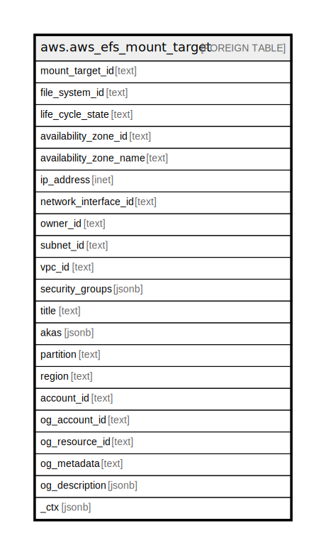

# aws.aws_efs_mount_target

## Description

AWS EFS Mount Target

## Columns

| Name | Type | Default | Nullable | Children | Parents | Comment |
| ---- | ---- | ------- | -------- | -------- | ------- | ------- |
| mount_target_id | text |  | true |  |  | The ID of the mount target. |
| file_system_id | text |  | true |  |  | The ID of the file system for which the mount target is intended. |
| life_cycle_state | text |  | true |  |  | Lifecycle state of the mount target. |
| availability_zone_id | text |  | true |  |  | The unique and consistent identifier of the Availability Zone that the mount target resides in. |
| availability_zone_name | text |  | true |  |  | The name of the Availability Zone in which the mount target is located. |
| ip_address | inet |  | true |  |  | Address at which the file system can be mounted by using the mount target. |
| network_interface_id | text |  | true |  |  | The ID of the network interface that Amazon EFS created when it created the mount target. |
| owner_id | text |  | true |  |  | AWS account ID that owns the resource. |
| subnet_id | text |  | true |  |  | The ID of the mount target's subnet. |
| vpc_id | text |  | true |  |  | The virtual private cloud (VPC) ID that the mount target is configured in. |
| security_groups | jsonb |  | true |  |  | Specifies the security groups currently in effect for a mount target. |
| title | text |  | true |  |  | Title of the resource. |
| akas | jsonb |  | true |  |  | Array of globally unique identifier strings (also known as) for the resource. |
| partition | text |  | true |  |  | The AWS partition in which the resource is located (aws, aws-cn, or aws-us-gov). |
| region | text |  | true |  |  | The AWS Region in which the resource is located. |
| account_id | text |  | true |  |  | The AWS Account ID in which the resource is located. |
| og_account_id | text |  | true |  |  | The Platform Account ID in which the resource is located. |
| og_resource_id | text |  | true |  |  | The unique ID of the resource in opengovernance. |
| og_metadata | text |  | true |  |  | Platform Metadata of the AWS resource. |
| og_description | jsonb |  | true |  |  | The full model description of the resource |
| _ctx | jsonb |  | true |  |  | Steampipe context in JSON form, e.g. connection_name. |

## Relations

---

> Generated by [tbls](https://github.com/k1LoW/tbls)
