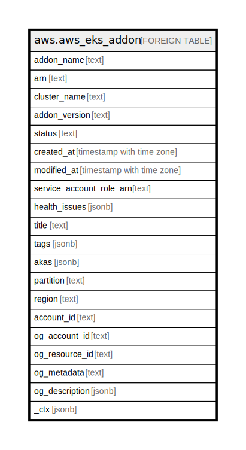

# aws.aws_eks_addon

## Description

AWS EKS Addon

## Columns

| Name | Type | Default | Nullable | Children | Parents | Comment |
| ---- | ---- | ------- | -------- | -------- | ------- | ------- |
| addon_name | text |  | true |  |  | The name of the add-on. |
| arn | text |  | true |  |  | The Amazon Resource Name (ARN) of the add-on. |
| cluster_name | text |  | true |  |  | The name of the cluster. |
| addon_version | text |  | true |  |  | The version of the add-on. |
| status | text |  | true |  |  | The status of the add-on. |
| created_at | timestamp with time zone |  | true |  |  | The date and time that the add-on was created. |
| modified_at | timestamp with time zone |  | true |  |  | The date and time that the add-on was last modified. |
| service_account_role_arn | text |  | true |  |  | The Amazon Resource Name (ARN) of the IAM role that is bound to the Kubernetes service account used by the add-on. |
| health_issues | jsonb |  | true |  |  | An object that represents the add-on's health issues. |
| title | text |  | true |  |  | Title of the resource. |
| tags | jsonb |  | true |  |  | The metadata that you apply to the cluster to assist with categorization and organization. |
| akas | jsonb |  | true |  |  | Array of globally unique identifier strings (also known as) for the resource. |
| partition | text |  | true |  |  | The AWS partition in which the resource is located (aws, aws-cn, or aws-us-gov). |
| region | text |  | true |  |  | The AWS Region in which the resource is located. |
| account_id | text |  | true |  |  | The AWS Account ID in which the resource is located. |
| og_account_id | text |  | true |  |  | The Platform Account ID in which the resource is located. |
| og_resource_id | text |  | true |  |  | The unique ID of the resource in opengovernance. |
| og_metadata | text |  | true |  |  | Platform Metadata of the AWS resource. |
| og_description | jsonb |  | true |  |  | The full model description of the resource |
| _ctx | jsonb |  | true |  |  | Steampipe context in JSON form, e.g. connection_name. |

## Relations

---

> Generated by [tbls](https://github.com/k1LoW/tbls)
