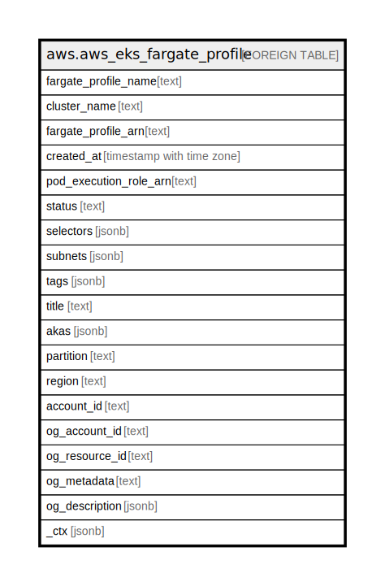

# aws.aws_eks_fargate_profile

## Description

AWS Elastic Kubernetes Service Fargate Profile

## Columns

| Name | Type | Default | Nullable | Children | Parents | Comment |
| ---- | ---- | ------- | -------- | -------- | ------- | ------- |
| fargate_profile_name | text |  | true |  |  | The name of the Fargate profile. |
| cluster_name | text |  | true |  |  | The name of the Amazon EKS cluster that the Fargate profile belongs to. |
| fargate_profile_arn | text |  | true |  |  | The full Amazon Resource Name (ARN) of the Fargate profile. |
| created_at | timestamp with time zone |  | true |  |  | The Unix epoch timestamp in seconds for when the Fargate profile was created. |
| pod_execution_role_arn | text |  | true |  |  | The Amazon Resource Name (ARN) of the pod execution role to use for pods that match the selectors in the Fargate profile. |
| status | text |  | true |  |  | The current status of the Fargate profile. |
| selectors | jsonb |  | true |  |  | The selectors to match for pods to use this Fargate profile. |
| subnets | jsonb |  | true |  |  | The subnets used by the Fargate profile. |
| tags | jsonb |  | true |  |  | A list of tags assigned to the Fargate profile. |
| title | text |  | true |  |  | Title of the resource. |
| akas | jsonb |  | true |  |  | Array of globally unique identifier strings (also known as) for the resource. |
| partition | text |  | true |  |  | The AWS partition in which the resource is located (aws, aws-cn, or aws-us-gov). |
| region | text |  | true |  |  | The AWS Region in which the resource is located. |
| account_id | text |  | true |  |  | The AWS Account ID in which the resource is located. |
| og_account_id | text |  | true |  |  | The Platform Account ID in which the resource is located. |
| og_resource_id | text |  | true |  |  | The unique ID of the resource in opengovernance. |
| og_metadata | text |  | true |  |  | Platform Metadata of the AWS resource. |
| og_description | jsonb |  | true |  |  | The full model description of the resource |
| _ctx | jsonb |  | true |  |  | Steampipe context in JSON form, e.g. connection_name. |

## Relations

---

> Generated by [tbls](https://github.com/k1LoW/tbls)
