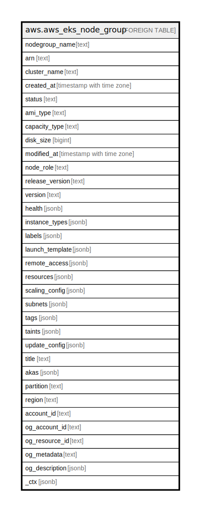

# aws.aws_eks_node_group

## Description

AWS EKS Node Group

## Columns

| Name | Type | Default | Nullable | Children | Parents | Comment |
| ---- | ---- | ------- | -------- | -------- | ------- | ------- |
| nodegroup_name | text |  | true |  |  | The name associated with an Amazon EKS managed node group. |
| arn | text |  | true |  |  | The Amazon Resource Name (ARN) associated with the managed node group. |
| cluster_name | text |  | true |  |  | The name of the cluster that the managed node group resides in. |
| created_at | timestamp with time zone |  | true |  |  | The Unix epoch timestamp in seconds for when the managed node group was created. |
| status | text |  | true |  |  | The current status of the managed node group. |
| ami_type | text |  | true |  |  | The AMI type that was specified in the node group configuration. |
| capacity_type | text |  | true |  |  | The capacity type of your managed node group. |
| disk_size | bigint |  | true |  |  | The disk size in the node group configuration. |
| modified_at | timestamp with time zone |  | true |  |  | The Unix epoch timestamp in seconds for when the managed node group was last modified. |
| node_role | text |  | true |  |  | The IAM role associated with your node group. |
| release_version | text |  | true |  |  | If the node group was deployed using a launch template with a custom AMI, then this is the AMI ID that was specified in the launch template. For node groups that weren't deployed using a launch template, this is the version of the Amazon EKS optimized AMI that the node group was deployed with. |
| version | text |  | true |  |  | The Kubernetes version of the managed node group. |
| health | jsonb |  | true |  |  | The health status of the node group. |
| instance_types | jsonb |  | true |  |  | The instance type that is associated with the node group. If the node group was deployed with a launch template, then this is null. |
| labels | jsonb |  | true |  |  | The Kubernetes labels applied to the nodes in the node group. |
| launch_template | jsonb |  | true |  |  | If a launch template was used to create the node group, then this is the launch template that was used. |
| remote_access | jsonb |  | true |  |  | The remote access configuration that is associated with the node group. If the node group was deployed with a launch template, then this is null. |
| resources | jsonb |  | true |  |  | The resources associated with the node group, such as Auto Scaling groups and security groups for remote access. |
| scaling_config | jsonb |  | true |  |  | The scaling configuration details for the Auto Scaling group that is associated with your node group. |
| subnets | jsonb |  | true |  |  | The subnets that were specified for the Auto Scaling group that is associated with your node group. |
| tags | jsonb |  | true |  |  | A map of tags for the resource. |
| taints | jsonb |  | true |  |  | The Kubernetes taints to be applied to the nodes in the node group when they are created. |
| update_config | jsonb |  | true |  |  | The node group update configuration. |
| title | text |  | true |  |  | Title of the resource. |
| akas | jsonb |  | true |  |  | Array of globally unique identifier strings (also known as) for the resource. |
| partition | text |  | true |  |  | The AWS partition in which the resource is located (aws, aws-cn, or aws-us-gov). |
| region | text |  | true |  |  | The AWS Region in which the resource is located. |
| account_id | text |  | true |  |  | The AWS Account ID in which the resource is located. |
| og_account_id | text |  | true |  |  | The Platform Account ID in which the resource is located. |
| og_resource_id | text |  | true |  |  | The unique ID of the resource in opengovernance. |
| og_metadata | text |  | true |  |  | Platform Metadata of the AWS resource. |
| og_description | jsonb |  | true |  |  | The full model description of the resource |
| _ctx | jsonb |  | true |  |  | Steampipe context in JSON form, e.g. connection_name. |

## Relations

---

> Generated by [tbls](https://github.com/k1LoW/tbls)
