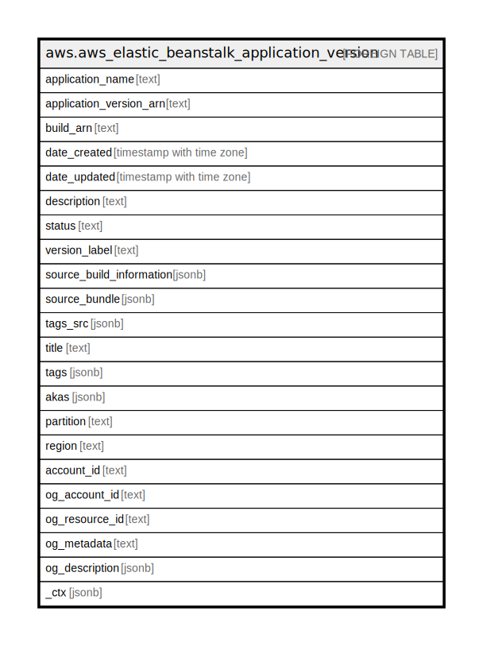

# aws.aws_elastic_beanstalk_application_version

## Description

AWS Elastic Beanstalk Application Version

## Columns

| Name | Type | Default | Nullable | Children | Parents | Comment |
| ---- | ---- | ------- | -------- | -------- | ------- | ------- |
| application_name | text |  | true |  |  | The name of the application to which the application version belongs. |
| application_version_arn | text |  | true |  |  | The Amazon Resource Name (ARN) of the application version. |
| build_arn | text |  | true |  |  | Reference to the artifact from the AWS CodeBuild build. |
| date_created | timestamp with time zone |  | true |  |  | The creation date of the application version. |
| date_updated | timestamp with time zone |  | true |  |  | The last modified date of the application version. |
| description | text |  | true |  |  | The description of the application version. |
| status | text |  | true |  |  | The processing status of the application version. Reflects the state of the application version during its creation. |
| version_label | text |  | true |  |  | A unique identifier for the application version. |
| source_build_information | jsonb |  | true |  |  | Information about the source code for the application version if the source code was retrieved from AWS CodeCommit. |
| source_bundle | jsonb |  | true |  |  | The storage location of the application version's source bundle in Amazon S3. |
| tags_src | jsonb |  | true |  |  | A list of tags assigned to the application. |
| title | text |  | true |  |  | A title for the resource, typically the resource name. |
| tags | jsonb |  | true |  |  | A map of tags for the resource. |
| akas | jsonb |  | true |  |  | Array of globally unique identifier strings (also known as) for the resource. |
| partition | text |  | true |  |  | The AWS partition in which the resource is located (aws, aws-cn, or aws-us-gov). |
| region | text |  | true |  |  | The AWS Region in which the resource is located. |
| account_id | text |  | true |  |  | The AWS Account ID in which the resource is located. |
| og_account_id | text |  | true |  |  | The Platform Account ID in which the resource is located. |
| og_resource_id | text |  | true |  |  | The unique ID of the resource in opengovernance. |
| og_metadata | text |  | true |  |  | Platform Metadata of the AWS resource. |
| og_description | jsonb |  | true |  |  | The full model description of the resource |
| _ctx | jsonb |  | true |  |  | Steampipe context in JSON form, e.g. connection_name. |

## Relations

---

> Generated by [tbls](https://github.com/k1LoW/tbls)
