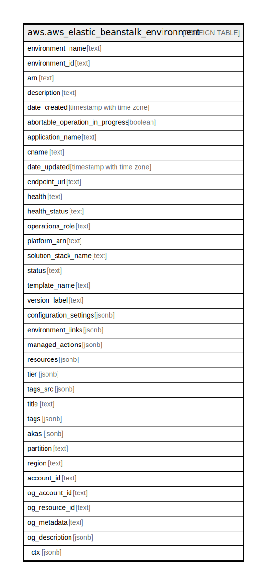

# aws.aws_elastic_beanstalk_environment

## Description

AWS ElasticBeanstalk Environment

## Columns

| Name | Type | Default | Nullable | Children | Parents | Comment |
| ---- | ---- | ------- | -------- | -------- | ------- | ------- |
| environment_name | text |  | true |  |  | The name of this environment. |
| environment_id | text |  | true |  |  | The ID of this environment. |
| arn | text |  | true |  |  | The environment's Amazon Resource Name (ARN). |
| description | text |  | true |  |  | Describes this environment. |
| date_created | timestamp with time zone |  | true |  |  | The creation date for this environment. |
| abortable_operation_in_progress | boolean |  | true |  |  | Indicates if there is an in-progress environment configuration update or application version deployment that you can cancel. |
| application_name | text |  | true |  |  | The name of the application associated with this environment. |
| cname | text |  | true |  |  | The URL to the CNAME for this environment. |
| date_updated | timestamp with time zone |  | true |  |  | The last modified date for this environment. |
| endpoint_url | text |  | true |  |  | The URL to the LoadBalancer. |
| health | text |  | true |  |  | The health status of the environment. |
| health_status | text |  | true |  |  | Returns the health status of the application running in your environment. |
| operations_role | text |  | true |  |  | The Amazon Resource Name (ARN) of the environment's operations role. |
| platform_arn | text |  | true |  |  | The ARN of the platform version. |
| solution_stack_name | text |  | true |  |  | The name of the SolutionStack deployed with this environment. |
| status | text |  | true |  |  | The current operational status of the environment. |
| template_name | text |  | true |  |  | The name of the configuration template used to originally launch this environment. |
| version_label | text |  | true |  |  | The application version deployed in this environment. |
| configuration_settings | jsonb |  | true |  |  | Returns a description of the settings for the specified configuration set, that is, either a configuration template or the configuration set associated with a running environment. |
| environment_links | jsonb |  | true |  |  | A list of links to other environments in the same group. |
| managed_actions | jsonb |  | true |  |  | A list of upcoming and in-progress managed actions. |
| resources | jsonb |  | true |  |  | The description of the AWS resources used by this environment. |
| tier | jsonb |  | true |  |  | Describes the current tier of this environment. |
| tags_src | jsonb |  | true |  |  | A list of tags assigned to the Repository |
| title | text |  | true |  |  | Title of the resource. |
| tags | jsonb |  | true |  |  |  |
| akas | jsonb |  | true |  |  | Array of globally unique identifier strings (also known as) for the resource. |
| partition | text |  | true |  |  | The AWS partition in which the resource is located (aws, aws-cn, or aws-us-gov). |
| region | text |  | true |  |  | The AWS Region in which the resource is located. |
| account_id | text |  | true |  |  | The AWS Account ID in which the resource is located. |
| og_account_id | text |  | true |  |  | The Platform Account ID in which the resource is located. |
| og_resource_id | text |  | true |  |  | The unique ID of the resource in opengovernance. |
| og_metadata | text |  | true |  |  | Platform Metadata of the AWS resource. |
| og_description | jsonb |  | true |  |  | The full model description of the resource |
| _ctx | jsonb |  | true |  |  | Steampipe context in JSON form, e.g. connection_name. |

## Relations

---

> Generated by [tbls](https://github.com/k1LoW/tbls)
