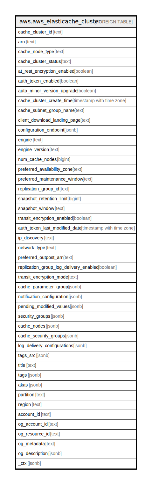

# aws.aws_elasticache_cluster

## Description

AWS ElastiCache Cluster

## Columns

| Name | Type | Default | Nullable | Children | Parents | Comment |
| ---- | ---- | ------- | -------- | -------- | ------- | ------- |
| cache_cluster_id | text |  | true |  |  | An unique identifier for ElastiCache cluster. |
| arn | text |  | true |  |  | The ARN (Amazon Resource Name) of the cache cluster. |
| cache_node_type | text |  | true |  |  | The name of the compute and memory capacity node type for the cluster. |
| cache_cluster_status | text |  | true |  |  | The current state of this cluster, one of the following values: available, creating, deleted, deleting, incompatible-network, modifying, rebooting cluster nodes, restore-failed, or snapshotting. |
| at_rest_encryption_enabled | boolean |  | true |  |  | A flag that enables encryption at-rest when set to true. |
| auth_token_enabled | boolean |  | true |  |  | A flag that enables using an AuthToken (password) when issuing Redis commands. |
| auto_minor_version_upgrade | boolean |  | true |  |  | This parameter is currently disabled. |
| cache_cluster_create_time | timestamp with time zone |  | true |  |  | The date and time when the cluster was created. |
| cache_subnet_group_name | text |  | true |  |  | The name of the cache subnet group associated with the cluster. |
| client_download_landing_page | text |  | true |  |  | The URL of the web page where you can download the latest ElastiCache client library. |
| configuration_endpoint | jsonb |  | true |  |  | Represents a Memcached cluster endpoint which can be used by an application to connect to any node in the cluster. |
| engine | text |  | true |  |  | The name of the cache engine (memcached or redis) to be used for this cluster. |
| engine_version | text |  | true |  |  | The version of the cache engine that is used in this cluster. |
| num_cache_nodes | bigint |  | true |  |  | The number of cache nodes in the cluster. |
| preferred_availability_zone | text |  | true |  |  | The name of the Availability Zone in which the cluster is located or 'Multiple' if the cache nodes are located in different Availability Zones. |
| preferred_maintenance_window | text |  | true |  |  | Specifies the weekly time range during which maintenance on the cluster is performed. |
| replication_group_id | text |  | true |  |  | The replication group to which this cluster belongs. |
| snapshot_retention_limit | bigint |  | true |  |  | The number of days for which ElastiCache retains automatic cluster snapshots before deleting them. |
| snapshot_window | text |  | true |  |  | The daily time range (in UTC) during which ElastiCache begins taking a daily snapshot of your cluster. |
| transit_encryption_enabled | boolean |  | true |  |  | A flag that enables in-transit encryption when set to true. |
| auth_token_last_modified_date | timestamp with time zone |  | true |  |  | The date the auth token was last modified. |
| ip_discovery | text |  | true |  |  | The network type associated with the cluster, either ipv4 or ipv6. |
| network_type | text |  | true |  |  | Must be either ipv4, ipv6, or dual_stack. |
| preferred_outpost_arn | text |  | true |  |  | The outpost ARN in which the cache cluster is created. |
| replication_group_log_delivery_enabled | boolean |  | true |  |  | A boolean value indicating whether log delivery is enabled for the replication group. |
| transit_encryption_mode | text |  | true |  |  | A setting that allows you to migrate your clients to use in-transit encryption, with no downtime. |
| cache_parameter_group | jsonb |  | true |  |  | Status of the cache parameter group. |
| notification_configuration | jsonb |  | true |  |  | Describes a notification topic and its status. |
| pending_modified_values | jsonb |  | true |  |  | A group of settings that are applied to the cluster in the future, or that are currently being applied. |
| security_groups | jsonb |  | true |  |  | A list of VPC Security Groups associated with the cluster. |
| cache_nodes | jsonb |  | true |  |  | A list of cache nodes that are members of the cluster. |
| cache_security_groups | jsonb |  | true |  |  | A list of cache security group elements, composed of name and status sub-elements. |
| log_delivery_configurations | jsonb |  | true |  |  | Returns the destination, format, and type of the logs. |
| tags_src | jsonb |  | true |  |  | A list of tags associated with the cluster. |
| title | text |  | true |  |  | Title of the resource. |
| tags | jsonb |  | true |  |  | A map of tags for the resource. |
| akas | jsonb |  | true |  |  | Array of globally unique identifier strings (also known as) for the resource. |
| partition | text |  | true |  |  | The AWS partition in which the resource is located (aws, aws-cn, or aws-us-gov). |
| region | text |  | true |  |  | The AWS Region in which the resource is located. |
| account_id | text |  | true |  |  | The AWS Account ID in which the resource is located. |
| og_account_id | text |  | true |  |  | The Platform Account ID in which the resource is located. |
| og_resource_id | text |  | true |  |  | The unique ID of the resource in opengovernance. |
| og_metadata | text |  | true |  |  | Platform Metadata of the AWS resource. |
| og_description | jsonb |  | true |  |  | The full model description of the resource |
| _ctx | jsonb |  | true |  |  | Steampipe context in JSON form, e.g. connection_name. |

## Relations

---

> Generated by [tbls](https://github.com/k1LoW/tbls)
