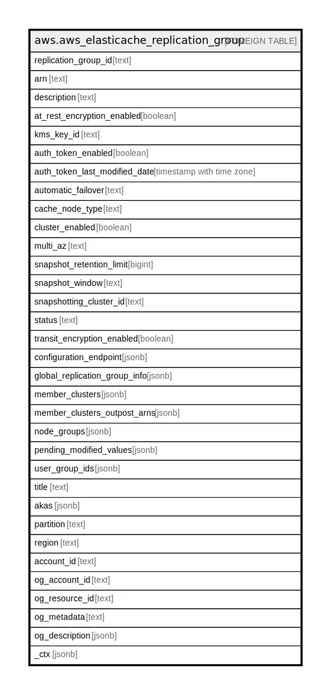

# aws.aws_elasticache_replication_group

## Description

AWS ElastiCache Replication Group

## Columns

| Name | Type | Default | Nullable | Children | Parents | Comment |
| ---- | ---- | ------- | -------- | -------- | ------- | ------- |
| replication_group_id | text |  | true |  |  | The identifier for the replication group. |
| arn | text |  | true |  |  | The ARN (Amazon Resource Name) of the replication group. |
| description | text |  | true |  |  | The user supplied description of the replication group. |
| at_rest_encryption_enabled | boolean |  | true |  |  | A flag that enables encryption at-rest when set to true. |
| kms_key_id | text |  | true |  |  | The ID of the KMS key used to encrypt the disk in the cluster. |
| auth_token_enabled | boolean |  | true |  |  | A flag that enables using an AuthToken (password) when issuing Redis commands. |
| auth_token_last_modified_date | timestamp with time zone |  | true |  |  | The date when the auth token was last modified. |
| automatic_failover | text |  | true |  |  | Indicates the status of automatic failover for this Redis replication group. |
| cache_node_type | text |  | true |  |  | The name of the compute and memory capacity node type for each node in the replication group. |
| cluster_enabled | boolean |  | true |  |  | A flag indicating whether or not this replication group is cluster enabled. |
| multi_az | text |  | true |  |  | A flag indicating if you have Multi-AZ enabled to enhance fault tolerance. |
| snapshot_retention_limit | bigint |  | true |  |  | The number of days for which ElastiCache retains automatic cluster snapshots before deleting them. |
| snapshot_window | text |  | true |  |  | The daily time range (in UTC) during which ElastiCache begins taking a daily snapshot of your node group (shard). |
| snapshotting_cluster_id | text |  | true |  |  | The cluster ID that is used as the daily snapshot source for the replication group. |
| status | text |  | true |  |  | The current state of this replication group - creating, available, modifying, deleting, create-failed, snapshotting. |
| transit_encryption_enabled | boolean |  | true |  |  | A flag that enables in-transit encryption when set to true. |
| configuration_endpoint | jsonb |  | true |  |  | The configuration endpoint for this replication group. |
| global_replication_group_info | jsonb |  | true |  |  | The name of the Global Datastore and role of this replication group in the Global Datastore. |
| member_clusters | jsonb |  | true |  |  | The names of all the cache clusters that are part of this replication group. |
| member_clusters_outpost_arns | jsonb |  | true |  |  | The outpost ARNs of the replication group's member clusters. |
| node_groups | jsonb |  | true |  |  | A list of node groups in this replication group. |
| pending_modified_values | jsonb |  | true |  |  | A group of settings to be applied to the replication group, either immediately or during the next maintenance window. |
| user_group_ids | jsonb |  | true |  |  | The list of user group IDs that have access to the replication group. |
| title | text |  | true |  |  | Title of the resource. |
| akas | jsonb |  | true |  |  | Array of globally unique identifier strings (also known as) for the resource. |
| partition | text |  | true |  |  | The AWS partition in which the resource is located (aws, aws-cn, or aws-us-gov). |
| region | text |  | true |  |  | The AWS Region in which the resource is located. |
| account_id | text |  | true |  |  | The AWS Account ID in which the resource is located. |
| og_account_id | text |  | true |  |  | The Platform Account ID in which the resource is located. |
| og_resource_id | text |  | true |  |  | The unique ID of the resource in opengovernance. |
| og_metadata | text |  | true |  |  | Platform Metadata of the AWS resource. |
| og_description | jsonb |  | true |  |  | The full model description of the resource |
| _ctx | jsonb |  | true |  |  | Steampipe context in JSON form, e.g. connection_name. |

## Relations

---

> Generated by [tbls](https://github.com/k1LoW/tbls)
