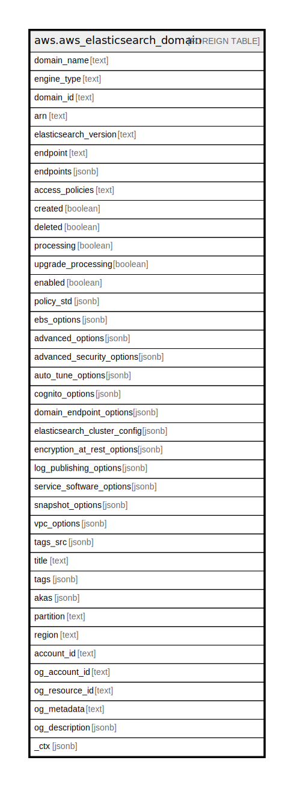

# aws.aws_elasticsearch_domain

## Description

AWS Elasticsearch Domain

## Columns

| Name | Type | Default | Nullable | Children | Parents | Comment |
| ---- | ---- | ------- | -------- | -------- | ------- | ------- |
| domain_name | text |  | true |  |  | The name of the domain. |
| engine_type | text |  | true |  |  | Specifies the EngineType of the domain. |
| domain_id | text |  | true |  |  | The id of the domain. |
| arn | text |  | true |  |  | The Amazon Resource Name (ARN) of the domain. |
| elasticsearch_version | text |  | true |  |  | The version for the Elasticsearch domain. |
| endpoint | text |  | true |  |  | The Elasticsearch domain endpoint that use to submit index and search requests. |
| endpoints | jsonb |  | true |  |  | The Elasticsearch domain endpoints that use to submit index and search requests. |
| access_policies | text |  | true |  |  | IAM access policy as a JSON-formatted string. |
| created | boolean |  | true |  |  | The domain creation status. |
| deleted | boolean |  | true |  |  | The domain deletion status. |
| processing | boolean |  | true |  |  | The status of the Elasticsearch domain configuration. |
| upgrade_processing | boolean |  | true |  |  | The status of an Elasticsearch domain version upgrade. |
| enabled | boolean |  | true |  |  | Specifies the status of the NodeToNodeEncryptionOptions. |
| policy_std | jsonb |  | true |  |  | Contains the policy in a canonical form for easier searching. |
| ebs_options | jsonb |  | true |  |  | Specifies whether EBS-based storage is enabled. |
| advanced_options | jsonb |  | true |  |  | Specifies the status of the AdvancedOptions. |
| advanced_security_options | jsonb |  | true |  |  | Specifies The current status of the Elasticsearch domain's advanced security options. |
| auto_tune_options | jsonb |  | true |  |  | The current status of the Elasticsearch domain's Auto-Tune options. |
| cognito_options | jsonb |  | true |  |  | The CognitoOptions for the specified domain. |
| domain_endpoint_options | jsonb |  | true |  |  | The current status of the Elasticsearch domain's endpoint options. |
| elasticsearch_cluster_config | jsonb |  | true |  |  | The type and number of instances in the domain cluster. |
| encryption_at_rest_options | jsonb |  | true |  |  | Specifies the status of the EncryptionAtRestOptions. |
| log_publishing_options | jsonb |  | true |  |  | Log publishing options for the given domain. |
| service_software_options | jsonb |  | true |  |  | The current status of the Elasticsearch domain's service software. |
| snapshot_options | jsonb |  | true |  |  | Specifies the status of the SnapshotOptions. |
| vpc_options | jsonb |  | true |  |  | The VPCOptions for the specified domain. |
| tags_src | jsonb |  | true |  |  | A list of tags assigned to the domain. |
| title | text |  | true |  |  | Title of the resource. |
| tags | jsonb |  | true |  |  | A map of tags for the resource. |
| akas | jsonb |  | true |  |  | Array of globally unique identifier strings (also known as) for the resource. |
| partition | text |  | true |  |  | The AWS partition in which the resource is located (aws, aws-cn, or aws-us-gov). |
| region | text |  | true |  |  | The AWS Region in which the resource is located. |
| account_id | text |  | true |  |  | The AWS Account ID in which the resource is located. |
| og_account_id | text |  | true |  |  | The Platform Account ID in which the resource is located. |
| og_resource_id | text |  | true |  |  | The unique ID of the resource in opengovernance. |
| og_metadata | text |  | true |  |  | Platform Metadata of the AWS resource. |
| og_description | jsonb |  | true |  |  | The full model description of the resource |
| _ctx | jsonb |  | true |  |  | Steampipe context in JSON form, e.g. connection_name. |

## Relations

---

> Generated by [tbls](https://github.com/k1LoW/tbls)
