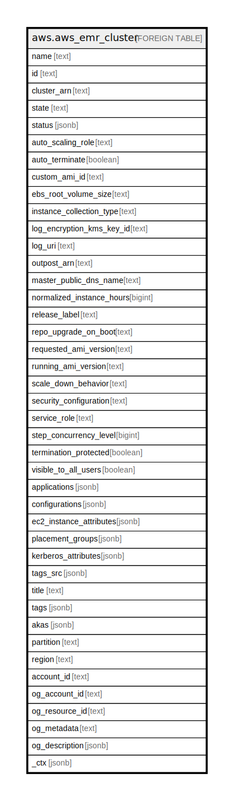

# aws.aws_emr_cluster

## Description

AWS EMR Cluster

## Columns

| Name | Type | Default | Nullable | Children | Parents | Comment |
| ---- | ---- | ------- | -------- | -------- | ------- | ------- |
| name | text |  | true |  |  | The name of the cluster. |
| id | text |  | true |  |  | The unique identifier for the cluster. |
| cluster_arn | text |  | true |  |  | The Amazon Resource Name of the cluster. |
| state | text |  | true |  |  | The current state of the cluster. |
| status | jsonb |  | true |  |  | The current status details about the cluster. |
| auto_scaling_role | text |  | true |  |  | An IAM role for automatic scaling policies. |
| auto_terminate | boolean |  | true |  |  | Specifies whether the cluster should terminate after completing all steps. |
| custom_ami_id | text |  | true |  |  | Available only in Amazon EMR version 5.7.0 and later. The ID of a custom Amazon EBS-backed Linux AMI if the cluster uses a custom AMI. |
| ebs_root_volume_size | text |  | true |  |  | The size of the Amazon EBS root device volume of the Linux AMI that is used for each EC2 instance, in GiB. Available in Amazon EMR version 4.x and later. |
| instance_collection_type | text |  | true |  |  | The instance group configuration of the cluster. |
| log_encryption_kms_key_id | text |  | true |  |  | The AWS KMS customer master key (CMK) used for encrypting log files. This attribute is only available with EMR version 5.30.0 and later, excluding EMR 6.0.0. |
| log_uri | text |  | true |  |  | The path to the Amazon S3 location where logs for this cluster are stored. |
| outpost_arn | text |  | true |  |  | The Amazon Resource Name (ARN) of the Outpost where the cluster is launched. |
| master_public_dns_name | text |  | true |  |  | The DNS name of the master node. |
| normalized_instance_hours | bigint |  | true |  |  | An approximation of the cost of the cluster, represented in m1.small/hours. |
| release_label | text |  | true |  |  | The Amazon EMR release label, which determines the version of open-source application packages installed on the cluster. |
| repo_upgrade_on_boot | text |  | true |  |  | Applies only when CustomAmiID is used. Specifies the type of updates that are applied from the Amazon Linux AMI package repositories when an instance boots using the AMI. |
| requested_ami_version | text |  | true |  |  | Applies only when CustomAmiID is used. Specifies the type of updates that are applied from the Amazon Linux AMI package repositories when an instance boots using the AMI. |
| running_ami_version | text |  | true |  |  | The AMI version running on this cluster. |
| scale_down_behavior | text |  | true |  |  | The way that individual Amazon EC2 instances terminate when an automatic scale-in activity occurs or an instance group is resized. |
| security_configuration | text |  | true |  |  | The name of the security configuration applied to the cluster. |
| service_role | text |  | true |  |  | The IAM role that will be assumed by the Amazon EMR service to access AWS resources on your behalf. |
| step_concurrency_level | bigint |  | true |  |  | Specifies the number of steps that can be executed concurrently. |
| termination_protected | boolean |  | true |  |  | Indicates whether Amazon EMR will lock the cluster to prevent the EC2 instances from being terminated by an API call or user intervention, or in the event of a cluster error. |
| visible_to_all_users | boolean |  | true |  |  | Indicates whether the cluster is visible to all IAM users of the AWS account associated with the cluster. |
| applications | jsonb |  | true |  |  | The applications installed on this cluster. |
| configurations | jsonb |  | true |  |  | Applies only to Amazon EMR releases 4.x and later. The list of Configurations supplied to the EMR cluster. |
| ec2_instance_attributes | jsonb |  | true |  |  | Provides information about the EC2 instances in a cluster grouped by category. |
| placement_groups | jsonb |  | true |  |  | Placement group configured for an Amazon EMR cluster. |
| kerberos_attributes | jsonb |  | true |  |  | Attributes for Kerberos configuration when Kerberos authentication is enabled using a security configuration. |
| tags_src | jsonb |  | true |  |  | A list of tags associated with a cluster. |
| title | text |  | true |  |  | Title of the resource. |
| tags | jsonb |  | true |  |  | A map of tags for the resource. |
| akas | jsonb |  | true |  |  | Array of globally unique identifier strings (also known as) for the resource. |
| partition | text |  | true |  |  | The AWS partition in which the resource is located (aws, aws-cn, or aws-us-gov). |
| region | text |  | true |  |  | The AWS Region in which the resource is located. |
| account_id | text |  | true |  |  | The AWS Account ID in which the resource is located. |
| og_account_id | text |  | true |  |  | The Platform Account ID in which the resource is located. |
| og_resource_id | text |  | true |  |  | The unique ID of the resource in opengovernance. |
| og_metadata | text |  | true |  |  | Platform Metadata of the AWS resource. |
| og_description | jsonb |  | true |  |  | The full model description of the resource |
| _ctx | jsonb |  | true |  |  | Steampipe context in JSON form, e.g. connection_name. |

## Relations

---

> Generated by [tbls](https://github.com/k1LoW/tbls)
