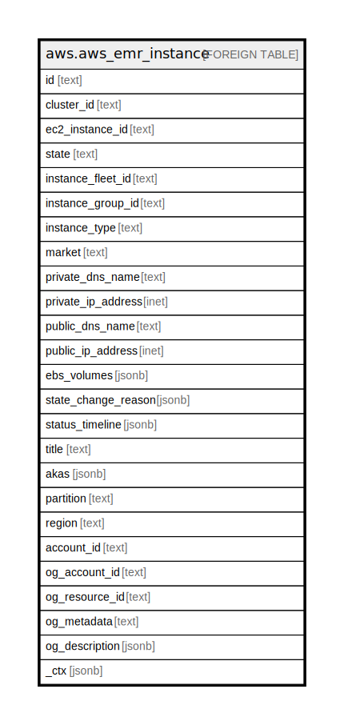

# aws.aws_emr_instance

## Description

AWS EMR Instance

## Columns

| Name | Type | Default | Nullable | Children | Parents | Comment |
| ---- | ---- | ------- | -------- | -------- | ------- | ------- |
| id | text |  | true |  |  | The unique identifier for the instance in Amazon EMR. |
| cluster_id | text |  | true |  |  | The unique identifier for the cluster. |
| ec2_instance_id | text |  | true |  |  | The unique identifier of the instance in Amazon EC2. |
| state | text |  | true |  |  | The current state of the instance. |
| instance_fleet_id | text |  | true |  |  | The unique identifier of the instance fleet to which an EC2 instance belongs. |
| instance_group_id | text |  | true |  |  | The identifier of the instance group to which this instance belongs. |
| instance_type | text |  | true |  |  | The EC2 instance type, for example m3.xlarge. |
| market | text |  | true |  |  | The instance purchasing option. Valid values are ON_DEMAND or SPOT. |
| private_dns_name | text |  | true |  |  | The private DNS name of the instance. |
| private_ip_address | inet |  | true |  |  | The private IP address of the instance. |
| public_dns_name | text |  | true |  |  | The public DNS name of the instance. |
| public_ip_address | inet |  | true |  |  | The public IP address of the instance. |
| ebs_volumes | jsonb |  | true |  |  | The list of Amazon EBS volumes that are attached to this instance. |
| state_change_reason | jsonb |  | true |  |  | The status change reason details for the instance. |
| status_timeline | jsonb |  | true |  |  | The timeline of the instance status over time. |
| title | text |  | true |  |  | Title of the resource. |
| akas | jsonb |  | true |  |  | Array of globally unique identifier strings (also known as) for the resource. |
| partition | text |  | true |  |  | The AWS partition in which the resource is located (aws, aws-cn, or aws-us-gov). |
| region | text |  | true |  |  | The AWS Region in which the resource is located. |
| account_id | text |  | true |  |  | The AWS Account ID in which the resource is located. |
| og_account_id | text |  | true |  |  | The Platform Account ID in which the resource is located. |
| og_resource_id | text |  | true |  |  | The unique ID of the resource in opengovernance. |
| og_metadata | text |  | true |  |  | Platform Metadata of the AWS resource. |
| og_description | jsonb |  | true |  |  | The full model description of the resource |
| _ctx | jsonb |  | true |  |  | Steampipe context in JSON form, e.g. connection_name. |

## Relations

---

> Generated by [tbls](https://github.com/k1LoW/tbls)
