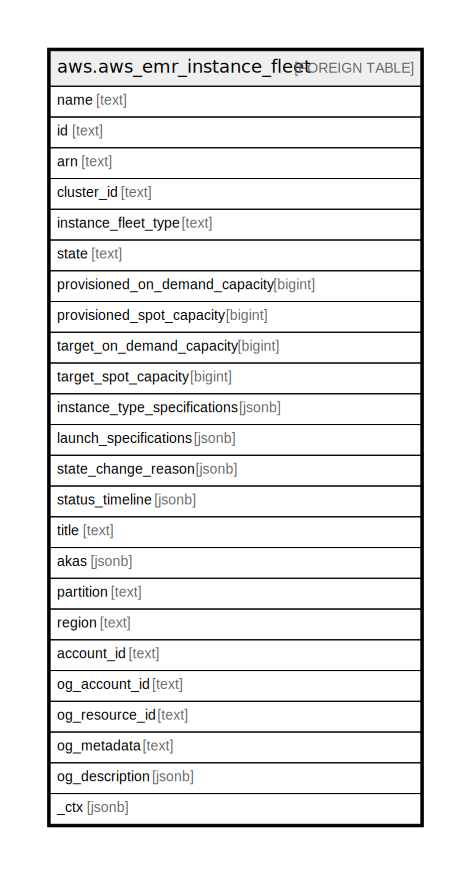

# aws.aws_emr_instance_fleet

## Description

AWS EMR Instance Fleet

## Columns

| Name | Type | Default | Nullable | Children | Parents | Comment |
| ---- | ---- | ------- | -------- | -------- | ------- | ------- |
| name | text |  | true |  |  | The name of the instance fleet. |
| id | text |  | true |  |  | The identifier of the instance fleet. |
| arn | text |  | true |  |  | The Amazon Resource Name (ARN) specifying the instance fleet. |
| cluster_id | text |  | true |  |  | The unique identifier for the cluster. |
| instance_fleet_type | text |  | true |  |  | The type of the instance fleet. Valid values are MASTER, CORE or TASK. |
| state | text |  | true |  |  | The current state of the instance fleet. |
| provisioned_on_demand_capacity | bigint |  | true |  |  | The number of On-Demand units that have been provisioned for the instance fleet to fulfill TargetOnDemandCapacity. |
| provisioned_spot_capacity | bigint |  | true |  |  | The number of Spot units that have been provisioned for this instance fleet to fulfill TargetSpotCapacity. |
| target_on_demand_capacity | bigint |  | true |  |  | The target capacity of On-Demand units for the instance fleet, which determines how many On-Demand Instances to provision. |
| target_spot_capacity | bigint |  | true |  |  | The target capacity of Spot units for the instance fleet, which determines how many Spot Instances to provision. |
| instance_type_specifications | jsonb |  | true |  |  | An array of specifications for the instance types that comprise an instance fleet. |
| launch_specifications | jsonb |  | true |  |  | Describes the launch specification for an instance fleet. |
| state_change_reason | jsonb |  | true |  |  | Provides status change reason details for the instance fleet. |
| status_timeline | jsonb |  | true |  |  | Provides historical timestamps for the instance fleet, including the time of creation, the time it became ready to run jobs, and the time of termination. |
| title | text |  | true |  |  | Title of the resource. |
| akas | jsonb |  | true |  |  | Array of globally unique identifier strings (also known as) for the resource. |
| partition | text |  | true |  |  | The AWS partition in which the resource is located (aws, aws-cn, or aws-us-gov). |
| region | text |  | true |  |  | The AWS Region in which the resource is located. |
| account_id | text |  | true |  |  | The AWS Account ID in which the resource is located. |
| og_account_id | text |  | true |  |  | The Platform Account ID in which the resource is located. |
| og_resource_id | text |  | true |  |  | The unique ID of the resource in opengovernance. |
| og_metadata | text |  | true |  |  | Platform Metadata of the AWS resource. |
| og_description | jsonb |  | true |  |  | The full model description of the resource |
| _ctx | jsonb |  | true |  |  | Steampipe context in JSON form, e.g. connection_name. |

## Relations

---

> Generated by [tbls](https://github.com/k1LoW/tbls)
