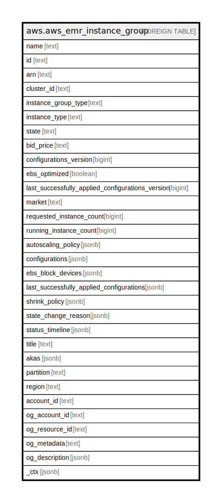

# aws.aws_emr_instance_group

## Description

AWS EMR Instance Group

## Columns

| Name | Type | Default | Nullable | Children | Parents | Comment |
| ---- | ---- | ------- | -------- | -------- | ------- | ------- |
| name | text |  | true |  |  | The name of the instance group. |
| id | text |  | true |  |  | The identifier of the instance group. |
| arn | text |  | true |  |  | The Amazon Resource Name (ARN) specifying the instance group. |
| cluster_id | text |  | true |  |  | The unique identifier for the cluster. |
| instance_group_type | text |  | true |  |  | The type of the instance group. Valid values are MASTER, CORE or TASK. |
| instance_type | text |  | true |  |  | The EC2 instance type for all instances in the instance group. |
| state | text |  | true |  |  | The current state of the instance group. |
| bid_price | text |  | true |  |  | The maximum price you are willing to pay for Spot Instances. If specified, indicates that the instance group uses Spot Instances. |
| configurations_version | bigint |  | true |  |  | The version number of the requested configuration specification for this instance group. |
| ebs_optimized | boolean |  | true |  |  | Indicates whether the instance group is EBS-optimized, or not.  An Amazon EBS-optimized instance uses an optimized configuration stack and provides additional, dedicated capacity for Amazon EBS I/O. |
| last_successfully_applied_configurations_version | bigint |  | true |  |  | The version number of a configuration specification that was successfully applied for an instance group last time. |
| market | text |  | true |  |  | The marketplace to provision instances for this group. Valid values are ON_DEMAND or SPOT. |
| requested_instance_count | bigint |  | true |  |  | The target number of instances for the instance group. |
| running_instance_count | bigint |  | true |  |  | The number of instances currently running in this instance group. |
| autoscaling_policy | jsonb |  | true |  |  | An automatic scaling policy for a core instance group or task instance group in an Amazon EMR cluster. |
| configurations | jsonb |  | true |  |  | A list of configurations supplied for an EMR cluster instance group. Only availbale for Amazon EMR releases 4.x or later. |
| ebs_block_devices | jsonb |  | true |  |  | The EBS block devices that are mapped to this instance group. |
| last_successfully_applied_configurations | jsonb |  | true |  |  | A list of configurations that were successfully applied for an instance group last time. |
| shrink_policy | jsonb |  | true |  |  | Policy for customizing shrink operations. |
| state_change_reason | jsonb |  | true |  |  | The status change reason details for the instance group. |
| status_timeline | jsonb |  | true |  |  | The timeline of the instance group status over time. |
| title | text |  | true |  |  | Title of the resource. |
| akas | jsonb |  | true |  |  | Array of globally unique identifier strings (also known as) for the resource. |
| partition | text |  | true |  |  | The AWS partition in which the resource is located (aws, aws-cn, or aws-us-gov). |
| region | text |  | true |  |  | The AWS Region in which the resource is located. |
| account_id | text |  | true |  |  | The AWS Account ID in which the resource is located. |
| og_account_id | text |  | true |  |  | The Platform Account ID in which the resource is located. |
| og_resource_id | text |  | true |  |  | The unique ID of the resource in opengovernance. |
| og_metadata | text |  | true |  |  | Platform Metadata of the AWS resource. |
| og_description | jsonb |  | true |  |  | The full model description of the resource |
| _ctx | jsonb |  | true |  |  | Steampipe context in JSON form, e.g. connection_name. |

## Relations

---

> Generated by [tbls](https://github.com/k1LoW/tbls)
