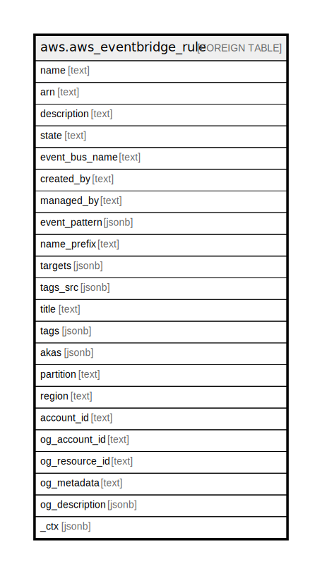

# aws.aws_eventbridge_rule

## Description

AWS EventBridge Rule

## Columns

| Name | Type | Default | Nullable | Children | Parents | Comment |
| ---- | ---- | ------- | -------- | -------- | ------- | ------- |
| name | text |  | true |  |  | The name of the rule. |
| arn | text |  | true |  |  | The Amazon Resource Name (ARN) of the rule. |
| description | text |  | true |  |  | The description of the rule. |
| state | text |  | true |  |  | The state of the rule. |
| event_bus_name | text |  | true |  |  | The name or ARN of the event bus associated with the rule. |
| created_by | text |  | true |  |  | The account ID of the user that created the rule. |
| managed_by | text |  | true |  |  | If this is a managed rule, created by an AWS service on your behalf, this field displays the principal name of the AWS service that created the rule. |
| event_pattern | jsonb |  | true |  |  | The event pattern of the rule. |
| name_prefix | text |  | true |  |  | Specifying this limits the results to only those event rules with names that start with the specified prefix. |
| targets | jsonb |  | true |  |  | The targets assigned to the rule. |
| tags_src | jsonb |  | true |  |  | A list of tags assigned to the rule. |
| title | text |  | true |  |  | Title of the resource. |
| tags | jsonb |  | true |  |  | A map of tags for the resource. |
| akas | jsonb |  | true |  |  | Array of globally unique identifier strings (also known as) for the resource. |
| partition | text |  | true |  |  | The AWS partition in which the resource is located (aws, aws-cn, or aws-us-gov). |
| region | text |  | true |  |  | The AWS Region in which the resource is located. |
| account_id | text |  | true |  |  | The AWS Account ID in which the resource is located. |
| og_account_id | text |  | true |  |  | The Platform Account ID in which the resource is located. |
| og_resource_id | text |  | true |  |  | The unique ID of the resource in opengovernance. |
| og_metadata | text |  | true |  |  | Platform Metadata of the AWS resource. |
| og_description | jsonb |  | true |  |  | The full model description of the resource |
| _ctx | jsonb |  | true |  |  | Steampipe context in JSON form, e.g. connection_name. |

## Relations

---

> Generated by [tbls](https://github.com/k1LoW/tbls)
