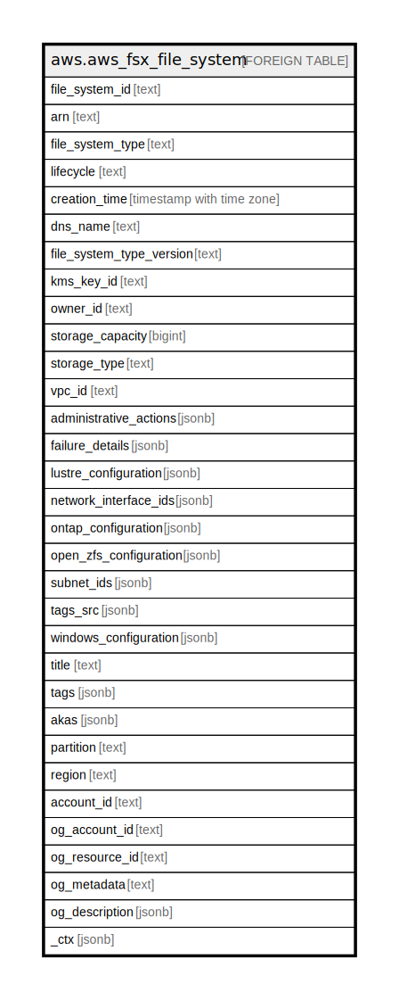

# aws.aws_fsx_file_system

## Description

AWS FSx File System

## Columns

| Name | Type | Default | Nullable | Children | Parents | Comment |
| ---- | ---- | ------- | -------- | -------- | ------- | ------- |
| file_system_id | text |  | true |  |  | The system-generated, unique 17-digit ID of the file system. |
| arn | text |  | true |  |  | The Amazon Resource Name (ARN) for the EFS file system. |
| file_system_type | text |  | true |  |  | The type of Amazon FSx file system, which can be LUSTRE, WINDOWS, or ONTAP. |
| lifecycle | text |  | true |  |  | The lifecycle status of the file system, following are the possible values AVAILABLE, CREATING, DELETING, FAILED, MISCONFIGURED, UPDATING. |
| creation_time | timestamp with time zone |  | true |  |  | The time that the file system was created. |
| dns_name | text |  | true |  |  | The DNS name for the file system. |
| file_system_type_version | text |  | true |  |  | The version of your Amazon FSx for Lustre file system, either 2.10 or 2.12. |
| kms_key_id | text |  | true |  |  | The ID of the Key Management Service (KMS) key used to encrypt the file system's. |
| owner_id | text |  | true |  |  | The AWS account that created the file system. |
| storage_capacity | bigint |  | true |  |  | The storage capacity of the file system in gibibytes (GiB). |
| storage_type | text |  | true |  |  | The storage type of the file system. |
| vpc_id | text |  | true |  |  | The ID of the primary VPC for the file system. |
| administrative_actions | jsonb |  | true |  |  | A list of administrative actions for the file system that are in process or waiting to be processed. |
| failure_details | jsonb |  | true |  |  | A structure providing details of any failures that occur when creating the file system has failed. |
| lustre_configuration | jsonb |  | true |  |  | The configuration for the Amazon FSx for Lustre file system. |
| network_interface_ids | jsonb |  | true |  |  | The IDs of the elastic network interface from which a specific file system is accessible. |
| ontap_configuration | jsonb |  | true |  |  | The configuration for this FSx for NetApp ONTAP file system. |
| open_zfs_configuration | jsonb |  | true |  |  | The configuration for this FSx for NetApp ONTAP file system. |
| subnet_ids | jsonb |  | true |  |  | Specifies the IDs of the subnets that the file system is accessible from. |
| tags_src | jsonb |  | true |  |  | A list of tags associated with Filesystem. |
| windows_configuration | jsonb |  | true |  |  | The configuration for this Microsoft Windows file system. |
| title | text |  | true |  |  | Title of the resource. |
| tags | jsonb |  | true |  |  | A map of tags for the resource. |
| akas | jsonb |  | true |  |  | Array of globally unique identifier strings (also known as) for the resource. |
| partition | text |  | true |  |  | The AWS partition in which the resource is located (aws, aws-cn, or aws-us-gov). |
| region | text |  | true |  |  | The AWS Region in which the resource is located. |
| account_id | text |  | true |  |  | The AWS Account ID in which the resource is located. |
| og_account_id | text |  | true |  |  | The Platform Account ID in which the resource is located. |
| og_resource_id | text |  | true |  |  | The unique ID of the resource in opengovernance. |
| og_metadata | text |  | true |  |  | Platform Metadata of the AWS resource. |
| og_description | jsonb |  | true |  |  | The full model description of the resource |
| _ctx | jsonb |  | true |  |  | Steampipe context in JSON form, e.g. connection_name. |

## Relations

---

> Generated by [tbls](https://github.com/k1LoW/tbls)
