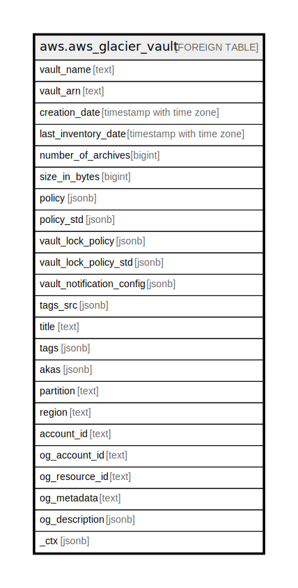

# aws.aws_glacier_vault

## Description

AWS Glacier Vault

## Columns

| Name | Type | Default | Nullable | Children | Parents | Comment |
| ---- | ---- | ------- | -------- | -------- | ------- | ------- |
| vault_name | text |  | true |  |  | The name of the vault. |
| vault_arn | text |  | true |  |  | The Amazon Resource Name (ARN) of the vault. |
| creation_date | timestamp with time zone |  | true |  |  | The Universal Coordinated Time (UTC) date when the vault was created. |
| last_inventory_date | timestamp with time zone |  | true |  |  | The Universal Coordinated Time (UTC) date when Amazon S3 Glacier completed the last vault inventory. |
| number_of_archives | bigint |  | true |  |  | The number of archives in the vault as of the last inventory date. |
| size_in_bytes | bigint |  | true |  |  | Total size, in bytes, of the archives in the vault as of the last inventory date. |
| policy | jsonb |  | true |  |  | Contains the returned vault access policy as a JSON string. |
| policy_std | jsonb |  | true |  |  | Contains the policy in a canonical form for easier searching. |
| vault_lock_policy | jsonb |  | true |  |  | The vault lock policy. |
| vault_lock_policy_std | jsonb |  | true |  |  | Contains the policy in a canonical form for easier searching. |
| vault_notification_config | jsonb |  | true |  |  | Contains the notification configuration set on the vault. |
| tags_src | jsonb |  | true |  |  | A list of tags associated with the vault. |
| title | text |  | true |  |  | Title of the resource. |
| tags | jsonb |  | true |  |  | A map of tags for the resource. |
| akas | jsonb |  | true |  |  | Array of globally unique identifier strings (also known as) for the resource. |
| partition | text |  | true |  |  | The AWS partition in which the resource is located (aws, aws-cn, or aws-us-gov). |
| region | text |  | true |  |  | The AWS Region in which the resource is located. |
| account_id | text |  | true |  |  | The AWS Account ID in which the resource is located. |
| og_account_id | text |  | true |  |  | The Platform Account ID in which the resource is located. |
| og_resource_id | text |  | true |  |  | The unique ID of the resource in opengovernance. |
| og_metadata | text |  | true |  |  | Platform Metadata of the AWS resource. |
| og_description | jsonb |  | true |  |  | The full model description of the resource |
| _ctx | jsonb |  | true |  |  | Steampipe context in JSON form, e.g. connection_name. |

## Relations

---

> Generated by [tbls](https://github.com/k1LoW/tbls)
