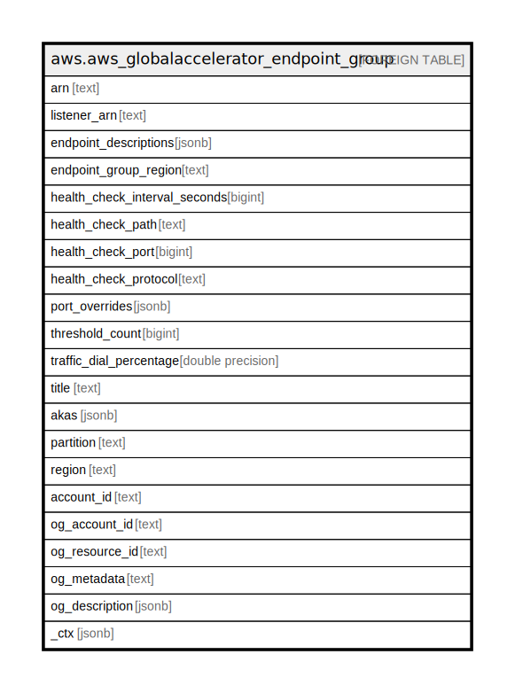

# aws.aws_globalaccelerator_endpoint_group

## Description

AWS Global Accelerator Endpoint Group

## Columns

| Name | Type | Default | Nullable | Children | Parents | Comment |
| ---- | ---- | ------- | -------- | -------- | ------- | ------- |
| arn | text |  | true |  |  | The Amazon Resource Name (ARN) of the endpoint group. |
| listener_arn | text |  | true |  |  | The Amazon Resource Name (ARN) of parent listener. |
| endpoint_descriptions | jsonb |  | true |  |  | The list of endpoint objects. |
| endpoint_group_region | text |  | true |  |  | The AWS Region where the endpoint group is located. |
| health_check_interval_seconds | bigint |  | true |  |  | The time—10 seconds or 30 seconds—between health checks for each endpoint. |
| health_check_path | text |  | true |  |  | If the protocol is HTTP/S, then this value provides the ping path that Global Accelerator uses for the destination on the endpoints for health checks. |
| health_check_port | bigint |  | true |  |  | The port that Global Accelerator uses to perform health checks on endpoints that are part of this endpoint group. |
| health_check_protocol | text |  | true |  |  | The protocol that Global Accelerator uses to perform health checks on endpoints that are part of this endpoint group. |
| port_overrides | jsonb |  | true |  |  | Overrides for destination ports used to route traffic to an endpoint. |
| threshold_count | bigint |  | true |  |  | The number of consecutive health checks required to set the state of a healthy endpoint to unhealthy, or to set an unhealthy endpoint to healthy. |
| traffic_dial_percentage | double precision |  | true |  |  | The percentage of traffic to send to an AWS Region. |
| title | text |  | true |  |  | Title of the resource. |
| akas | jsonb |  | true |  |  | Array of globally unique identifier strings (also known as) for the resource. |
| partition | text |  | true |  |  | The AWS partition in which the resource is located (aws, aws-cn, or aws-us-gov). |
| region | text |  | true |  |  | The AWS Region in which the resource is located. |
| account_id | text |  | true |  |  | The AWS Account ID in which the resource is located. |
| og_account_id | text |  | true |  |  | The Platform Account ID in which the resource is located. |
| og_resource_id | text |  | true |  |  | The unique ID of the resource in opengovernance. |
| og_metadata | text |  | true |  |  | Platform Metadata of the AWS resource. |
| og_description | jsonb |  | true |  |  | The full model description of the resource |
| _ctx | jsonb |  | true |  |  | Steampipe context in JSON form, e.g. connection_name. |

## Relations

---

> Generated by [tbls](https://github.com/k1LoW/tbls)
