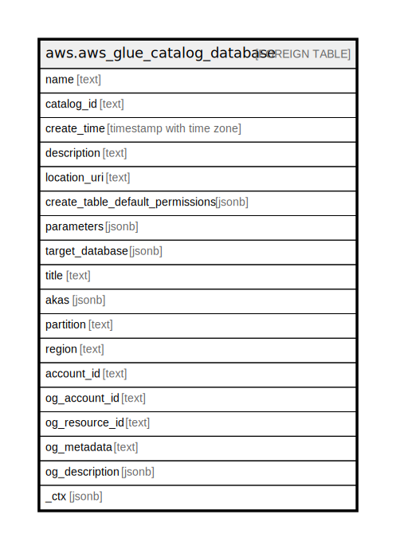

# aws.aws_glue_catalog_database

## Description

AWS Glue Catalog Database

## Columns

| Name | Type | Default | Nullable | Children | Parents | Comment |
| ---- | ---- | ------- | -------- | -------- | ------- | ------- |
| name | text |  | true |  |  | The name of the database. For Hive compatibility, this is folded to lowercase when it is stored. |
| catalog_id | text |  | true |  |  | The ID of the Data Catalog in which the database resides. |
| create_time | timestamp with time zone |  | true |  |  | The time at which the metadata database was created in the catalog. |
| description | text |  | true |  |  | A description of the database. |
| location_uri | text |  | true |  |  | The location of the database (for example, an HDFS path). |
| create_table_default_permissions | jsonb |  | true |  |  | Creates a set of default permissions on the table for principals. |
| parameters | jsonb |  | true |  |  | These key-value pairs define parameters and properties of the database. |
| target_database | jsonb |  | true |  |  | A DatabaseIdentifier structure that describes a target database for resource linking. |
| title | text |  | true |  |  | Title of the resource. |
| akas | jsonb |  | true |  |  | Array of globally unique identifier strings (also known as) for the resource. |
| partition | text |  | true |  |  | The AWS partition in which the resource is located (aws, aws-cn, or aws-us-gov). |
| region | text |  | true |  |  | The AWS Region in which the resource is located. |
| account_id | text |  | true |  |  | The AWS Account ID in which the resource is located. |
| og_account_id | text |  | true |  |  | The Platform Account ID in which the resource is located. |
| og_resource_id | text |  | true |  |  | The unique ID of the resource in opengovernance. |
| og_metadata | text |  | true |  |  | Platform Metadata of the AWS resource. |
| og_description | jsonb |  | true |  |  | The full model description of the resource |
| _ctx | jsonb |  | true |  |  | Steampipe context in JSON form, e.g. connection_name. |

## Relations

---

> Generated by [tbls](https://github.com/k1LoW/tbls)
